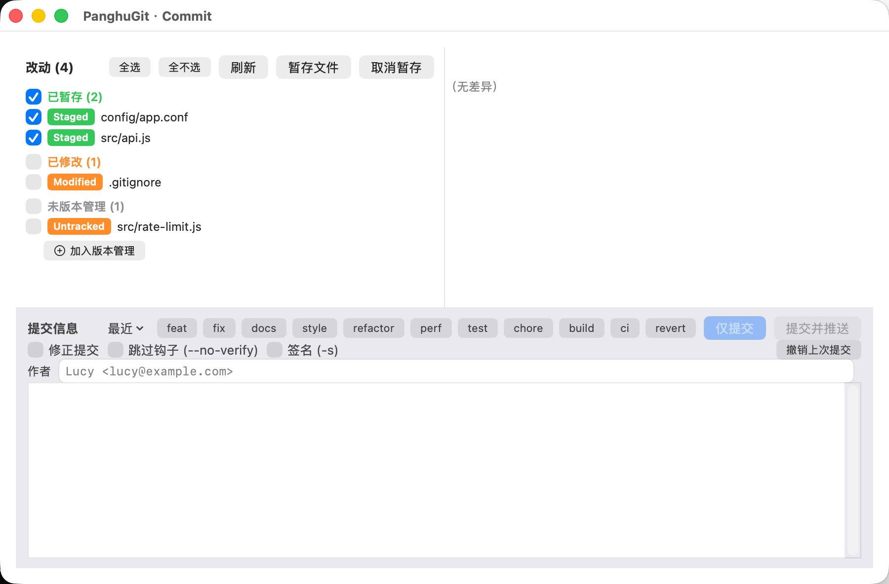
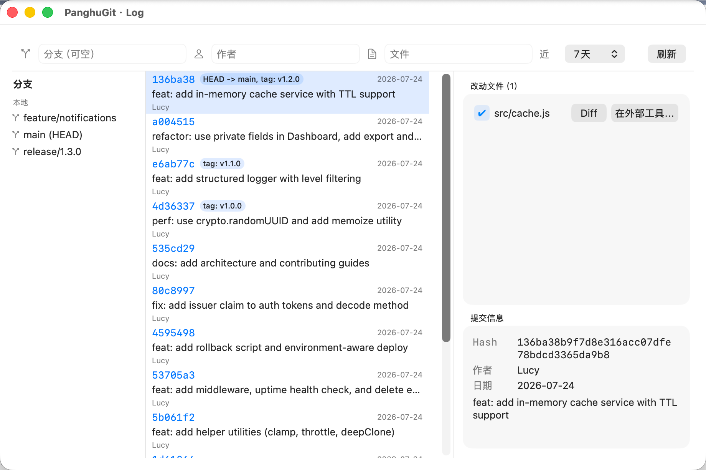
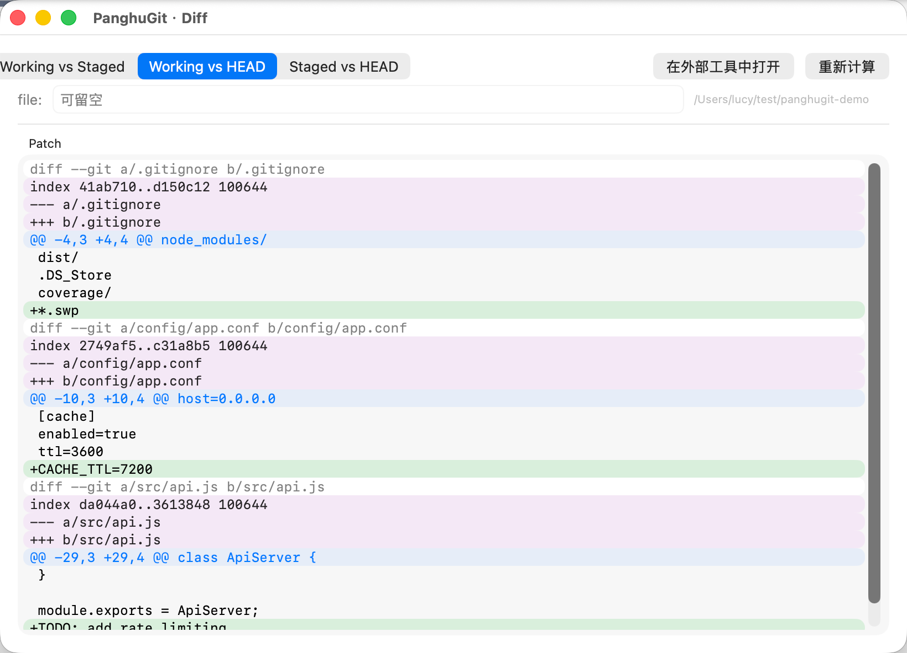
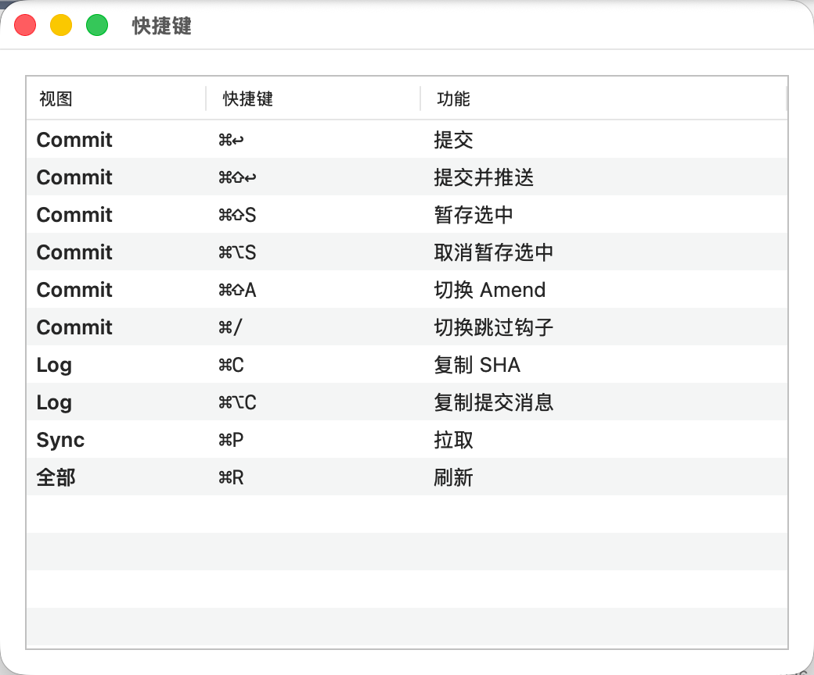

# PanghuGit

<p align="center">
  
</p>

<p align="center">
  <strong>macOS Finder 右键菜单 Git 工具</strong>
</p>

<p align="center">
  <a href="./README.en.md">English</a> | 中文
</p>

<p align="center">
  <a href="https://github.com/lucycoding/PanghuGit/actions/workflows/ci.yml"></a>
  <a href="https://github.com/lucycoding/PanghuGit/releases"></a>
  <a href="./LICENSE"></a>
  
  
</p>

<p align="center">
  <a href="#安装">安装</a> · <a href="#功能">功能</a> · <a href="#构建">构建</a> · <a href="#技术架构">架构</a> · <a href="#贡献">贡献</a>
</p>

---

## 简介

PanghuGit 是一款 macOS Finder 右键菜单 Git 工具。无需打开终端或 Git GUI，在 Finder 中右键即可完成日常 Git 操作。

**特点：**

- 纯原生 Swift + SwiftUI，零外部依赖
- Finder Sync 扩展集成，右键菜单 + 文件角标
- 覆盖 Git 全流程：提交、推送、分支、合并、变基、冲突解决、Blame、Submodule、Worktree、Bisect 等
- 中英双语界面，设置中一键切换
- 命令行模式 `panghugit`，支持 tab-completion

## 截图

| Finder 右键菜单 | Commit 提交 |
|:---:|:---:|
|  |  |
| **Log 日志** | **Diff 差异对比** |
|  |  |
| **语言设置** | **键盘快捷键** |
|  |  |

> [查看更多功能截图 →](docs/USER-MANUAL.md)

## 功能

### Finder 右键菜单

在 Finder 中任意目录右键即可使用：

```
PanghuGit ▶
  Git Commit…           提交更改（Hunk 级暂存 / Amend / Signoff / Conventional Commits）
  Git Sync…             Pull / Push / Fetch（--prune / --tags / --rebase / --force-with-lease）
  ─────────────────
  Git Log…              提交历史（分支侧边栏 + 渐进加载 + Diff 高亮 + Cherry-pick）
  Git Diff              工作区差异对比（语法高亮 + Hunk 级暂存）
  Git Modifications…    修改文件概览
  ─────────────────
  Git Switch…           切换分支 / 检出提交（自动 stash 脏工作区）
  Git Branch Manager…   分支管理（创建 / 删除 / 重命名 / 从指定提交创建）
  Git Stash…            暂存管理（per-file 浏览 / --keep-index / stash branch）
  Git Tags…             标签管理
  Git Merge / Rebase…   合并 / 变基
  Git Revert / Reset…   回退 / 重置（Undo last commit / Soft / Mixed / Hard）
  ─────────────────
  Git Init Here         当前目录初始化仓库
  Git Clone…            克隆远程仓库
  Git Add to .gitignore 添加忽略规则
  Git Blame…            逐行追溯（面包屑导航 + 前一版本跳转）
  Git Submodule…        子模块管理（sync / update all）
  Git Worktree…         Worktree 管理
  Git Patch…            补丁创建 / 应用 / 预览 / Dry Run
  Git Export…           归档导出（git archive）
  Git Cleanup…          清理未跟踪文件（git clean）
  Git Bisect…           二分查找（Good/Bad/Skip + 输出解析）
  Git Reflog…           引用日志
  Git Repo Settings…    仓库级配置（config 编辑 / hooks 管理）
  Git Settings…         全局设置
```

### 核心特性

| 特性 | 说明 |
|---|---|
| **Finder 角标** | 自动显示文件状态角标（修改/新增/删除/未跟踪/冲突/忽略） |
| **Hunk 级暂存** | Commit / Diff 视图中可逐 hunk 暂存或取消暂存，无需整文件操作 |
| **3-way 冲突解决** | Ours / Base / Theirs 三栏对比，逐块选择，手动编辑模式，FileMerge 集成 |
| **Log 渐进加载** | 默认加载 7 天记录，底部"加载更多"追加 50 条，避免大仓库超时 |
| **Cherry-pick** | Log 视图多选提交后批量 Cherry-pick |
| **Diff 语法高亮** | 新增行绿色底、删除行红色底、文件头紫色底、hunk 头蓝色底 |
| **分支侧边栏** | 本地 + 远程分支列表，点击切换 Log 视图筛选 |
| **Conventional Commits** | 内置 feat/fix/docs 等 11 种类型快选，可自定义模板 |
| **Author 自动补全** | Commit 视图 Author 字段从 git log 历史中实时筛选，Top 5 建议 |
| **Diff 工具集成** | 内置 DiffView / FileMerge(opendiff) / vimdiff / 自定义工具 |
| **键盘快捷键** | ⌘↩ Commit / ⌘⇧↩ Commit & Push / ⌘⇧S Stage / ⌘⌥S Unstage / ⌘R Refresh 等 |
| **中英双语** | 完整中文 + 英文界面，设置中一键切换 |
| **panghugit CLI** | 命令行模式，支持 tab-completion（zsh + bash） |
| **菜单样式** | 子菜单模式（默认）或扁平模式，设置中切换 |
| **终端集成** | 可选 Terminal / iTerm2 / Warp 作为默认终端 |
| **Git 路径四级回退** | 用户指定 → PATH → /usr/bin/git → App 内置 git |

### 键盘快捷键

| 快捷键 | 功能 | 所在视图 |
|--------|------|----------|
| ⌘↩ | Commit | Commit |
| ⌘⇧↩ | Commit & Push | Commit |
| ⌘⇧S | Stage selected | Commit |
| ⌘⌥S | Unstage selected | Commit |
| ⌘⇧A | Toggle Amend | Commit |
| ⌘/ | Toggle Skip Hooks | Commit |
| ⌘R | Refresh | 全部视图 |
| ⌘C | Copy SHA | Log |
| ⌘⌥C | Copy commit message | Log |
| ⌘P | Pull | Sync |

## 安装

### 方式一：从源码编译（推荐，无需 Apple 开发者账号）

```bash
# 1. 克隆仓库
git clone https://github.com/lucycoding/PanghuGit.git
cd PanghuGit

# 2. 一键构建 + 安装（ad-hoc 签名，本机可用）
./scripts/local-install.sh
```

脚本会自动完成：生成 xcodeproj → 编译 Release → ad-hoc 签名 → 安装到 `/Applications` → 注册 Finder 扩展 → 重启 Finder。

### 方式二：Homebrew（从源码编译）

```bash
# 添加 tap
brew tap lucycoding/tap https://github.com/lucycoding/homebrew-tap

# 安装（自动编译）
brew install panghugit
```

### 方式三：下载 DMG（需要付费 Apple 开发者账号签名公证）

> **注意**：未公证的 DMG 会被 macOS Gatekeeper 拦截。如果你没有付费 Apple 开发者账号，推荐使用方式一或方式二。

```bash
# 下载后拖入 /Applications
# 首次运行需在 系统设置 → 隐私与安全性 → 点击「仍要打开」
# 或终端执行：
xattr -dr com.apple.quarantine /Applications/PanghuGit.app
```

### 首次运行

1. 打开 `/Applications/PanghuGit.app`
2. 如遇安全提示，前往 **系统设置 → 隐私与安全性** → 点击「仍要打开」
3. 在 WelcomeView 点击 **「启用扩展」**，在系统弹窗中确认
4. 若 Finder 右键仍看不到菜单，点击 **「重启 Finder」** 或终端执行 `killall Finder`
5. 此后 Finder 任意目录右键即可看到 `PanghuGit ▶` 菜单

> ⚠️ **不要从 DMG 中直接双击运行**，macOS App Translocation 会导致 Finder Sync 扩展无法注册。

### 卸载

```bash
./scripts/local-uninstall.sh
```

会清理：App、Finder Sync 扩展注册、Preferences、Caches、Group Containers。

## 构建

### 前置要求

- macOS 13.0（Ventura）及以上
- Xcode 15+
- [xcodegen](https://github.com/yonaskolb/XcodeGen)：`brew install xcodegen`
- [SwiftLint](https://github.com/realm/SwiftLint)（可选）：`brew install swiftlint`

### 命令行构建

```bash
# 生成 xcodeproj
xcodegen generate

# 构建（跳过签名，本地验证用）
xcodebuild -project PanghuGit.xcodeproj \
           -scheme PanghuGit \
           -configuration Release \
           -destination 'generic/platform=macOS' \
           build CODE_SIGN_IDENTITY="-" \
                 CODE_SIGNING_REQUIRED=NO \
                 DEVELOPMENT_TEAM=""
```

### 本地安装

```bash
# 一键构建 + 安装（推荐）
./scripts/local-install.sh

# 跳过构建，仅安装已有产物
./scripts/local-install.sh --skip-build
```

### 打包 DMG（需付费 Apple 开发者账号）

```bash
# 本地验证（跳过签名/公证）
./scripts/package.sh

# 签名 + 公证
PANGHUGIT_DEVELOPMENT_TEAM=ABC123 \
PANGHUGIT_NOTARY_USER=you@apple.id \
PANGHUGIT_NOTARY_PASSWORD=app-specific-password \
./scripts/package.sh --sign
```

## 技术架构

```
┌─────────────────────────────────────────────────────┐
│                    macOS Finder                      │
│                                                     │
│  ┌──────────────────┐    ┌────────────────────────┐ │
│  │  Finder Sync     │    │   主 App (SwiftUI)     │ │
│  │  Extension       │───▶│                        │ │
│  │  (沙盒)          │URL │   CommitView           │ │
│  │                  │    │   LogView              │ │
│  │  - 右键菜单      │    │   DiffView             │ │
│  │  - 文件角标      │    │   SwitchView           │ │
│  │                  │    │   SettingsView          │ │
│  └──────────────────┘    │   ...                  │ │
│                          │                        │ │
│                          │   GitRunner ──────────▶│ git CLI
│                          └────────────────────────┘ │
└─────────────────────────────────────────────────────┘

通信方式：panghugit:// URL Scheme + App Group UserDefaults + DistributedNotificationCenter
```

### 关键设计

| 组件 | 说明 |
|---|---|
| **Finder Sync Extension** | 沙盒进程，负责右键菜单和文件角标；通过 `panghugit://` URL Scheme 唤起主 App |
| **主 App** | 非沙盒，执行所有 Git 操作；通过 `NSAppleEventManager` 接收 URL 事件 |
| **App Group** | `com.lucy.panghugit` UserDefaults suite，主 App 与扩展共享设置 |
| **GitRunner** | Git CLI 封装，支持超时控制；路径通过 `GitLocator` 四级回退解析 |
| **GitDirResolver** | 解析 .git 目录，支持 worktree 的 `gitdir:` 文件指向 |
| **GitTaskHelper** | 结构化并发封装，统一 `Task` + `GitRunner` 调用模式 |
| **L10n** | 扩展内从主 App bundle 加载本地化字符串（walk up from .appex to .app） |

### Git 路径解析优先级

1. Settings 中用户指定的 `gitPath`
2. PATH 中的 `git`（`which git`）
3. `/usr/bin/git`（Xcode CLT）
4. App bundle 内 `Contents/Resources/git/bin/git`（可选内置，零依赖分发）

## 目录结构

```
PanghuGit/
├── Shared/                          # 主 App + 扩展共享源码（23 个文件）
│   ├── GitRunner.swift              # Git CLI 封装（超时/输出捕获）
│   ├── GitLocator.swift             # Git 路径四级回退解析
│   ├── GitTaskHelper.swift          # 结构化并发封装
│   ├── GitStatusParser.swift        # git status --porcelain 解析
│   ├── LogQuery.swift               # git log 解析（渐进加载）
│   ├── BranchQuery.swift            # 分支列表查询
│   ├── MergeQuery.swift             # 合并冲突检测
│   ├── ConflictParser.swift         # 3-way 合并冲突解析
│   ├── HunkParser.swift             # Diff hunk 解析 + patch 构建
│   ├── DiffLineRenderer.swift       # Diff 行类型分类
│   ├── GitDirResolver.swift         # .git 目录解析（worktree 支持）
│   ├── CommitArgsBuilder.swift      # Commit 参数构建
│   ├── CommitFileStatus.swift       # 提交文件状态枚举
│   ├── StashTagQueries.swift        # Stash/Tag 查询
│   ├── BlameSubmoduleRepoConfig.swift # Blame/Submodule/Config 查询
│   ├── RepoProbe.swift              # 仓库根探测
│   ├── SettingsStore.swift          # App Group 共享设置
│   ├── L10n.swift                   # 本地化（扩展内自动解析主 bundle）
│   ├── PanghuGitAction.swift        # URL Scheme action 定义
│   ├── StatusBadge.swift            # 角标图标映射
│   ├── StatusBarView.swift          # 统一状态栏组件
│   ├── EmptyStateView.swift         # 空状态组件
│   └── BisectOutputParser.swift     # Bisect 输出解析
├── PanghuGit/                       # 主应用（SwiftUI，非沙盒）
│   ├── PanghuGitApp.swift           # App 入口
│   ├── AppDelegate.swift            # NSAppleEventManager + 菜单栏
│   ├── HostWindowController.swift   # 独立窗口管理（960×600）
│   ├── ActionRouter.swift           # URL scheme 路由
│   ├── CLI.swift                    # 命令行接口
│   ├── BundleDiagnostics.swift      # 安装自检 + 自动修复
│   ├── CommitView.swift             # 提交视图（主结构）
│   ├── CommitChangesList.swift      # 提交 - 改动列表
│   ├── CommitDiffPane.swift         # 提交 - Diff 面板
│   ├── CommitEditorSection.swift    # 提交 - 消息编辑
│   ├── CommitActions.swift          # 提交 - 行为方法
│   ├── LogView.swift                # Log 视图（分支侧边栏 + 渐进加载）
│   ├── DiffView.swift               # Diff 视图（语法高亮）
│   ├── SyncView.swift               # Pull / Push / Fetch
│   ├── SwitchView.swift             # 分支切换
│   ├── BranchManagerView.swift      # 分支管理
│   ├── StashView.swift              # 暂存管理
│   ├── TagView.swift                # 标签管理
│   ├── MergeRebaseView.swift        # 合并 / 变基
│   ├── ConflictResolverView.swift   # 冲突解决
│   ├── ConflictDetailView.swift     # 3-way 冲突详情
│   ├── RevertResetView.swift        # 回退 / 重置
│   ├── InitCloneView.swift          # 初始化 / 克隆
│   ├── IgnoreView.swift             # .gitignore 管理
│   ├── BlameView.swift              # Blame 视图
│   ├── SubmoduleView.swift          # 子模块管理
│   ├── WorktreeView.swift           # Worktree 管理
│   ├── BisectView.swift             # Bisect
│   ├── ReflogView.swift             # Reflog
│   ├── PatchView.swift              # 补丁创建 / 应用
│   ├── ExportView.swift             # 归档导出
│   ├── CleanupView.swift            # 清理未跟踪
│   ├── ModificationsView.swift      # 修改概览
│   ├── SettingsView.swift           # 设置（通用/Git/语言/忽略/提交）
│   ├── RepoSettingsView.swift       # 仓库级配置
│   ├── WelcomeView.swift            # 欢迎页
│   ├── ShortcutsView.swift          # 快捷键参考
│   ├── CommitPickerView.swift       # 提交选择器
│   ├── en.lproj/                    # 英文本地化
│   ├── zh-Hans.lproj/               # 中文本地化
│   └── Assets.xcassets/             # 图标资源
├── PanghuGitFinderSync/             # Finder Sync 扩展（沙盒）
│   ├── FinderSync.swift             # 右键菜单 + 角标注册
│   ├── BadgeWatcher.swift           # 后台 git status 监控
│   └── Assets.xcassets/             # 扩展图标
├── Tests/PanghuGitTests/            # 单元测试（23 个文件，163 个测试）
├── scripts/                         # 构建 / 安装 / 打包脚本
│   ├── local-install.sh             # 本地一键构建安装
│   ├── local-uninstall.sh           # 卸载
│   ├── package.sh                   # DMG 打包
│   ├── install_cli.sh               # CLI 安装
│   ├── fetch_git.sh                 # 下载便携 git
│   ├── commitlint.sh                # 提交信息检查
│   ├── install_commitlint.sh        # 安装 commitlint hook
│   ├── verify_cask.sh               # Homebrew Cask 验证
│   └── verify_checksum.sh           # DMG 校验
├── completion/                      # Shell 补全脚本
│   ├── zsh/_panghugit
│   └── bash/panghugit.bash
├── Formula/panghugit.rb             # Homebrew Formula（从源码编译）
├── Casks/panghugit.rb               # Homebrew Cask（预编译 DMG）
├── docs/                            # 文档
│   ├── USER-MANUAL.md               # 用户手册
│   └── DEVELOPER-GUIDE.md           # 开发者指南
├── .github/workflows/               # CI/CD
│   ├── ci.yml                       # 持续集成
│   └── release.yml                  # 自动发布
└── project.yml                      # xcodegen 工程定义
```

## 命令行（panghugit CLI）

PanghuGit 主可执行文件同时支持 argv 模式：

```bash
# 安装为 panghugit 命令
./scripts/install_cli.sh

# 使用
panghugit version
panghugit log /path/to/repo --oneline -n 10
panghugit diff /path/to/repo --staged
panghugit open commit /path/to/repo    # 唤起 GUI 提交窗口
```

| 命令 | 说明 |
|---|---|
| `panghugit version` | 版本号 |
| `panghugit which <path>` | 仓库根路径 |
| `panghugit branch <path>` | 分支列表 |
| `panghugit log <path> [--author\|--branch\|--since\|-n\|--oneline\|--graph]` | 提交历史 |
| `panghugit diff <path> [--staged\|--HEAD\|<a> <b>] [-- <file>]` | 差异 |
| `panghugit show <path> <ref> [--stat\|--patch]` | 提交详情 |
| `panghugit open <action> <path>` | 唤起 GUI |

## 测试

```bash
# 运行全部测试
xcodebuild test -project PanghuGit.xcodeproj \
                -scheme PanghuGit \
                -destination 'platform=macOS' \
                -only-testing:PanghuGitTests
```

当前 163 个单元测试，覆盖：

| 测试文件 | 覆盖内容 |
|---|---|
| `GitStatusParserTests` | git status --porcelain 解析 |
| `GitFileStatusTests` | 文件状态枚举 + 角标映射 |
| `CommitFileStatusTests` | 提交文件状态 + 图标映射 |
| `LogQueryEntryParsingTests` | git log 输出解析 |
| `BranchQueryParsingTests` | branch --list 输出解析 |
| `DiffViewLineParsingTests` | diff patch 行类型判断 |
| `HunkParserTests` | Diff hunk 解析 |
| `HunkParserExtendedTests` | Hunk 边界情况（空 hunk / 二进制 diff） |
| `ConflictParserTests` | 3-way 合并冲突标记解析 |
| `BisectOutputParserTests` | Bisect 输出解析 |
| `WorktreeViewTests` | Worktree 列表解析 |
| `MergeQueryTests` | 冲突 XY 标记检测 |
| `SubmoduleQueryTests` | .gitmodules 解析 |
| `RepoProbeTests` | 仓库根探测 |
| `SettingsStoreTests` | 设置枚举值 + 模板序列化 |
| `PanghuGitURLSchemeTests` | URL Scheme 编解码 |
| `ActionRouterTests` / `ActionRouterIdTests` | URL Scheme 路由 |
| `CommitViewLogicTests` | 提交视图逻辑 |
| `SyncViewLogicTests` | 同步视图逻辑 |
| `GitErrorMessageTests` | 友好错误消息映射 |
| `GitListResultTests` | GitListResult 枚举行为 |
| `RepoConfigQueryTests` | 仓库配置查询解析 |

## 关于签名与公证

| 场景 | 方式 | 是否需要付费 Apple 开发者账号 |
|---|---|---|
| 源码开源到 GitHub | 直接推代码 | **否** |
| 自己日常使用 | `local-install.sh` ad-hoc 签名 | **否** |
| 其他用户从源码安装 | Homebrew Formula / `local-install.sh` | **否** |
| 上传预编译 DMG | Developer ID 签名 + Apple 公证 | **是** |

**不注册付费开发者账号完全可以使用和开源本项目。** 源码分发 + 本地 ad-hoc 签名自用 + Homebrew formula 给社区用户，是零成本最优解。

## 贡献

欢迎贡献！请参阅 [CONTRIBUTING.md](./CONTRIBUTING.md) 了解详细的开发流程和规范。

快速开始：

1. Fork 本仓库
2. 创建功能分支：`git checkout -b feat/your-feature`
3. 提交更改（使用 [Conventional Commits](https://www.conventionalcommits.org/) 格式）
4. 推送分支：`git push origin feat/your-feature`
5. 创建 Pull Request

开发者指南：[docs/DEVELOPER-GUIDE.md](./docs/DEVELOPER-GUIDE.md)

## 许可证

[MIT License](./LICENSE)
