# PanghuGit User Manual

> **Version:** 1.0.0 | **Platform:** macOS 13.0+ | **Language:** Simplified Chinese / English

PanghuGit is a macOS Finder context menu Git tool (similar to TortoiseGit on Windows). It injects Git operations into the Finder context menu via a Finder Sync Extension, letting you complete everyday Git workflows without leaving Finder.

---

## Table of Contents

1. [Quick Start](#1-quick-start)
2. [Finder Context Menu](#2-finder-context-menu)
3. [File Status Badges](#3-file-status-badges)
4. [Git Commit](#4-git-commit)
5. [Git Diff](#5-git-diff)
6. [Check for Modifications](#6-check-for-modifications)
7. [Git Sync (Pull / Push / Fetch)](#7-git-sync)
8. [Git Log](#8-git-log)
9. [Git Switch](#9-git-switch)
10. [Git Branch Manager](#10-git-branch-manager)
11. [Git Tags](#11-git-tags)
12. [Git Stash](#12-git-stash)
13. [Git Merge / Rebase](#13-git-merge--rebase)
14. [Conflict Resolution](#14-conflict-resolution)
15. [Git Revert / Reset](#15-git-revert--reset)
16. [Git Init / Clone](#16-git-init--clone)
17. [Git Add to .gitignore](#17-git-add-to-gitignore)
18. [Git Blame](#18-git-blame)
19. [Git Submodule](#19-git-submodule)
20. [Git Repo Settings](#20-git-repo-settings)
21. [Git Reflog](#21-git-reflog)
22. [Git Patch](#22-git-patch)
23. [Git Export](#23-git-export)
24. [Git Cleanup](#24-git-cleanup)
25. [Git Bisect](#25-git-bisect)
26. [Git Worktree](#26-git-worktree)
27. [Global Settings](#27-global-settings)
28. [Help Menu](#28-help-menu)
29. [Command Line Interface](#29-command-line-interface)
30. [Keyboard Shortcuts](#30-keyboard-shortcuts)
31. [FAQ](#31-faq)

---

## 1. Quick Start

### Installation

1. Drag `PanghuGit/` into `/Applications/`
2. On first launch, the system will prompt to enable the Finder Sync Extension:
   - Click **"Enable Extension"**, or
   - Manually go to **System Settings → Privacy & Security → Extensions → File Providers** and check PanghuGit
3. After launch, PanghuGit runs in the menu bar in accessory mode (no Dock icon), and the context menu is ready to use

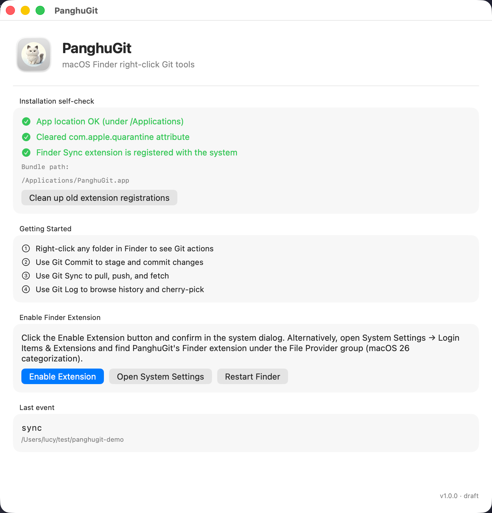

### Basic Workflow

| Step | Action | Context Menu Item |
|------|--------|-------------------|
| 1 | View changes after editing files | **Git Commit…** |
| 2 | Check files to stage, write commit message | Click **Commit** |
| 3 | Push to remote | Click **Commit & Push** |
| 4 | Pull remote updates | **Git Sync…** → Pull |
| 5 | View commit history | **Git Log…** |

---

## 2. Finder Context Menu

Right-click a file or folder in Finder to see the **PanghuGit** submenu (default) or directly displayed menu items.

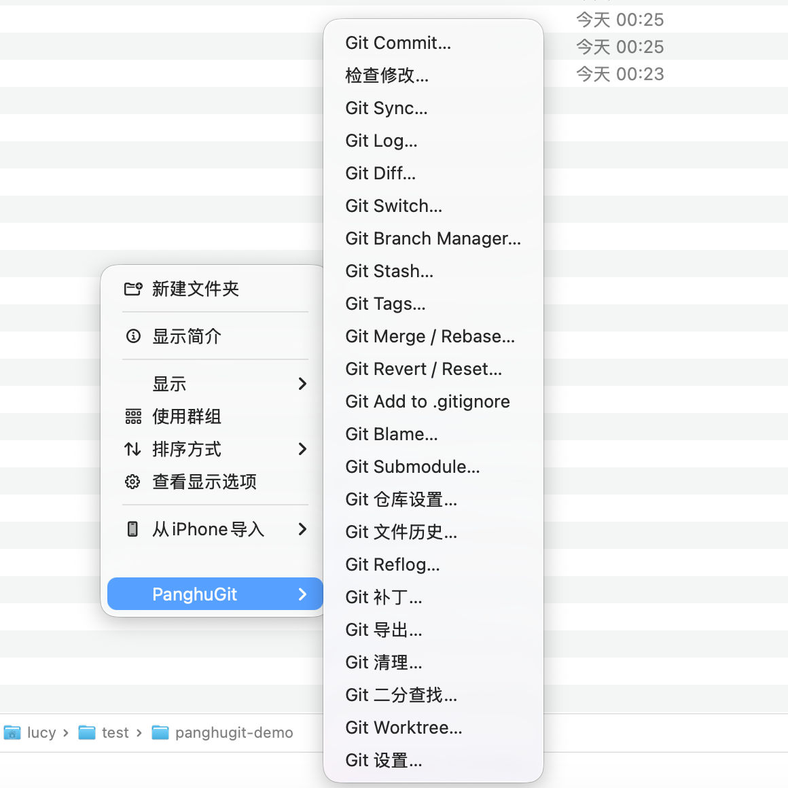

### Menu Style

Switchable in **Git Settings → General**:

| Style | Description |
|-------|-------------|
| **Submenu** (default) | All operations nested under the "PanghuGit" submenu |
| **Flat** | All operations displayed directly in the context menu |

### Menu Item Groups

| Menu Item | Group | Display Condition | Description |
|-----------|-------|-------------------|-------------|
| Git Commit… | Repo operations | Inside a Git repo | Open commit panel |
| Check for Modifications… | Repo operations | Inside a Git repo | View all modified files |
| Git Sync… | Repo operations | Inside a Git repo | Pull / Push / Fetch |
| Git Log… | Repo operations | Inside a Git repo | View commit history |
| Git Diff… | Repo operations | Inside a Git repo | View working tree diff |
| Git Switch… | Repo operations | Inside a Git repo | Switch branch |
| Git Merge / Rebase… | Repo operations | Inside a Git repo | Merge or rebase |
| Git Revert / Reset… | Repo operations | Inside a Git repo | Revert or reset |
| Git Branch Manager… | Repo management | Inside a Git repo | Manage branches |
| Git Stash… | Repo management | Inside a Git repo | Stash management |
| Git Tags… | Repo management | Inside a Git repo | Tag management |
| Git Submodule… | Repo management | Inside a Git repo | Submodule management |
| Git Repo Settings… | Repo management | Inside a Git repo | Repo configuration |
| Git Reflog… | Repo management | Inside a Git repo | Reference log |
| Git Patch… | Repo management | Inside a Git repo | Patch operations |
| Git Export… | Repo management | Inside a Git repo | Archive export |
| Git Cleanup… | Repo management | Inside a Git repo | Clean untracked files |
| Git Bisect… | Repo management | Inside a Git repo | Binary search |
| Git Worktree… | Repo management | Inside a Git repo | Worktree management |
| Git Init Here | Non-repo operations | **Not** in a Git repo | Initialize new repo |
| Git Clone… | Non-repo operations | **Not** in a Git repo | Clone remote repo |
| Git Add to .gitignore | File operations | In repo + file selected | Add ignore rules |
| Git Blame… | File operations | In repo + file selected | Line-by-line blame |
| Git File History… | File operations | In repo + file selected | File history |
| Git Settings… | Always shown | Anywhere | Open global settings |

> **Note:** Menu items ending with `…` (ellipsis) indicate the action opens a new window for further input; items without ellipsis are immediate actions.

---

## 3. File Status Badges

PanghuGit displays Git status badges on Finder icons:

| Badge | Status | Meaning |
|-------|--------|---------|
| ❗ | Modified | Working tree modified (unstaged) |
| ➕ | Staged / Added | Staged for commit / New file |
| ❓ | Untracked | Not tracked by Git |
| ✖ | Conflict | Merge conflict exists |
| 🚫 | Ignored | Ignored by .gitignore |
| ➖ | Deleted | Deleted |

### Badge Refresh

- Auto-refreshes on a timer; interval configurable in **Settings → Ignore & Badges** (0.5–10 seconds, default 2 seconds)
- Automatically triggers refresh after Commit / Push / Merge operations

---

## 4. Git Commit


### Layout

```
┌──────────────────────────────────────────────────┐
│  Left: Changed files list  │  Right: Diff preview │
│  ┌─ Staged ────────┐      │                      │
│  │ ☑ file1.swift   │      │  diff --git a/...    │
│  │ ☑ file2.swift   │      │  - old line          │
│  ├─ Modified ──────┤      │  + new line          │
│  │ ☐ file3.swift   │      │                      │
│  ├─ Untracked ─────┤      │  [Stage Hunk] [Unstage]│
│  │ ☐ newfile.swift │      │                      │
│  └─────────────────┘      │                      │
├──────────────────────────────────────────────────┤
│  [feat][fix][docs]...  Commit message editor      │
│  Templates ▾ Recent ▾                             │
│  ┌─────────────────────────────────────────────┐ │
│  │ feat: add user authentication               │ │
│  │                                             │ │
│  │ Implement JWT-based auth...                 │ │
│  └─────────────────────────────────────────────┘ │
│  Author: [                      ] ▾               │
│  ☐ Amend  ☐ Skip hooks  ☐ Sign-off               │
│  [Commit ⌘↩]  [Commit & Push ⌘⇧↩]  [Undo]      │
└──────────────────────────────────────────────────┘
```

### File Operations

| Action | Description |
|--------|-------------|
| Check/Uncheck | Stage/Unstage file (`git add` / `git reset HEAD`) |
| Click file | View file diff |
| Double-click file | Open with default application |
| Right-click file | Context menu: Open / Open With / Show in Finder / Stage / Unstage / Restore / Delete / Difftool |

### Hunk-level Staging

In the diff preview, use **Stage Hunk** / **Unstage Hunk** buttons to stage or unstage individual diff hunks instead of entire files.

### Conventional Commits

When **Settings → Commit → Enable Conventional Commits → Enable** is on, type quick-select buttons appear above the commit message editor:

`feat` `fix` `docs` `style` `refactor` `perf` `test` `chore` `build` `ci` `revert`

Clicking a button inserts the `<type>:` prefix at the beginning of the commit message.

### Commit Templates

Add templates in **Settings → Commit → Custom Templates**, then select from the **Templates** dropdown when committing.

### Author Field

- Leave empty: Uses repo or global git user config
- Custom format: `Name <email>`, passed as `--author` argument
- Dropdown suggestions: Auto-completes co-authors from repo history

### Options

| Option | Git Argument | Description |
|--------|-------------|-------------|
| Amend | `--amend` | Amend the last commit |
| Skip hooks | `--no-verify` | Skip git hooks |
| Sign-off | `-s` | Add `Signed-off-by` signature |

### Amend + Push

When both Amend and Push are used, a force push is required. PanghuGit shows a confirmation dialog with **Force with Lease** (recommended) and **Normal** options.

### Keyboard Shortcuts

| Shortcut | Action |
|----------|--------|
| ⌘↩ | Commit |
| ⌘⇧↩ | Commit & Push |
| ⌘⇧S | Stage selected files |
| ⌘⌥S | Unstage selected files |
| ⌘⇧A | Toggle Amend |
| ⌘/ | Toggle Skip Hooks |
| ⌘R | Refresh |

---

## 5. Git Diff

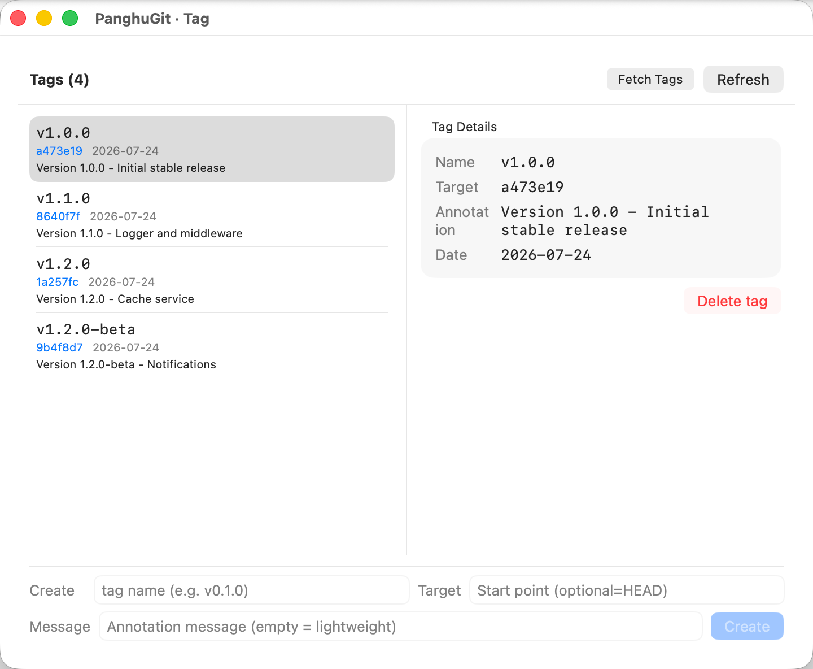

### Mode Selection

Switch via the top segmented control:

| Mode | Git Command | Description |
|------|------------|-------------|
| Working vs Staged | `git diff -- <file>` | Working tree vs staging area |
| Working vs HEAD | `git diff HEAD -- <file>` | Working tree vs HEAD |
| Staged vs HEAD | `git diff --staged HEAD -- <file>` | Staging area vs HEAD |

### Other Features

- **File path filter**: Filter specific files via the top file path field
- **Open in Difftool**: Open with external diff tool (configured in Settings)
- **Color coding**: Added lines (green), deleted lines (red), context lines (default)

---

## 6. Check for Modifications

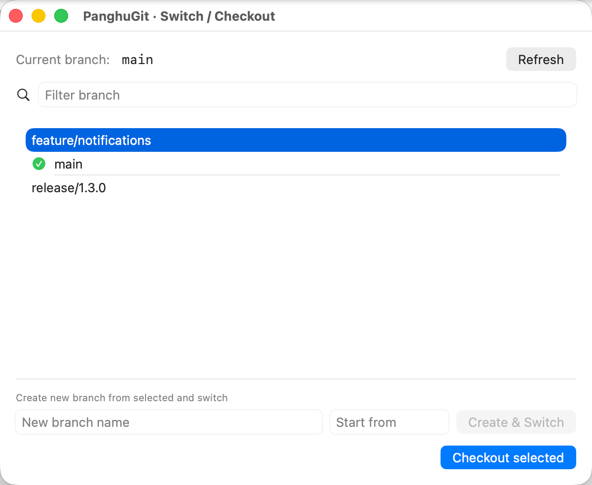

Quick overview of all modified/staged/untracked files:

- **Left**: File list with status badge icons
- **Right**: Diff preview of selected file
- Right-click files for Stage / Unstage / Restore / Delete actions

---

## 7. Git Sync

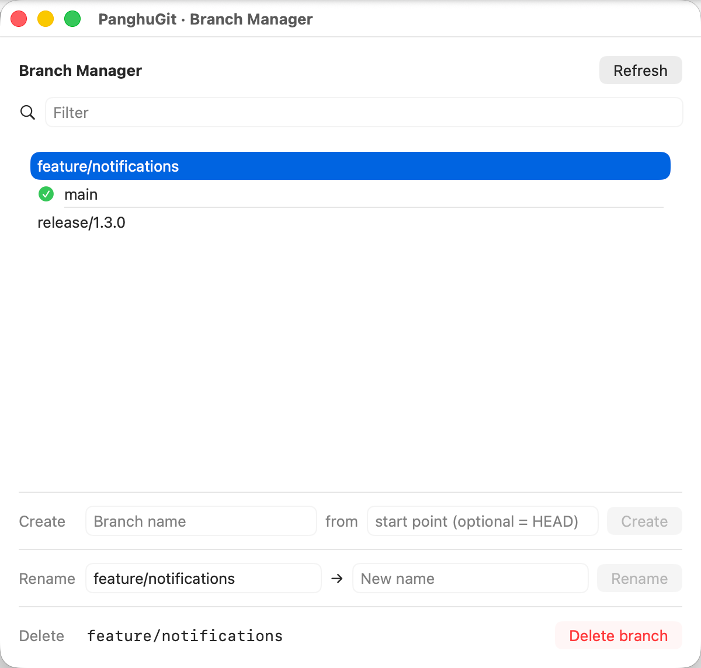

### Layout

```
┌──────────────────────────────────────────────────┐
│  Repository: /path/to/repo                       │
│  Current Branch: main                            │
│                                                  │
│  Remote: [origin    ]   Branch: [main    ] [Current]│
│                                                  │
│  [⬇ Pull ⌘P]  [⬆ Push]  [⬇ Fetch]            │
│  Pull: [Merge | Rebase]   Force: [Normal ▾]      │
│  ☐ Tags   ☐ Prune   ☐ Skip hooks                │
│                                                  │
│  ┌─ Output ─────────────────────────────────────┐│
│  │ Already up to date.                          ││
│  └──────────────────────────────────────────────┘│
└──────────────────────────────────────────────────┘
```

### Operations

| Operation | Git Command | Description |
|-----------|------------|-------------|
| Pull | `git pull <remote> <branch> [--rebase]` | Fetch and merge/rebase |
| Push | `git push <remote> <branch> [--force\|--force-with-lease] [--tags] [--no-verify]` | Push to remote |
| Fetch | `git fetch <remote> <branch> [--prune]` | Fetch only, no merge |

### Options

| Option | Description |
|--------|-------------|
| Pull: Merge / Rebase | Choose merge strategy |
| Force: Normal / Force / Force with Lease | Push force mode |
| Tags | Include tags when pushing (`--tags`) |
| Prune | Prune deleted remote branches when fetching (`--prune`) |
| Skip hooks | Skip git hooks (`--no-verify`) |
| "Use Current" | Auto-fill current branch name |

### Force Push Confirmation

When Force or Force with Lease is selected, PanghuGit calculates the number of remote commits that would be overwritten and shows a confirmation dialog.

---

## 8. Git Log

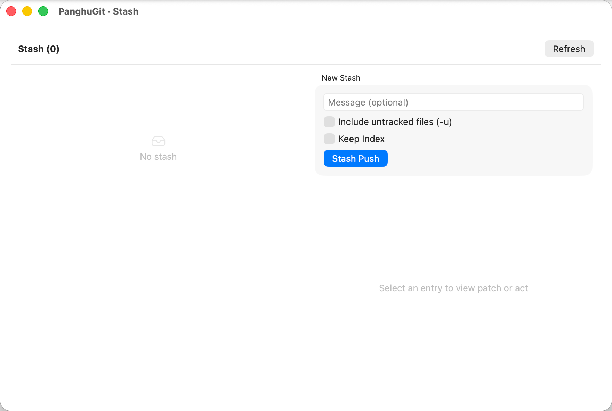

### Layout

```
┌────────┬──────────────────────┬──────────────────┐
│ Branch │ Commit records       │ Detail panel      │
│        │                      │                   │
│ Local  │ abc1234 (HEAD→main)  │ Changed Files(3) │
│ * main │ def5678              │  M  file1.swift  │
│ dev    │ ghi9012              │  A  file2.swift  │
│        │                      │  D  file3.swift  │
│ Remote │                      │                   │
│ origin │                      │ Commit Info       │
│  main  │                      │ Hash: abc123...  │
│  dev   │                      │ Author: Lucy     │
│        │ [Load More]          │ Date: 2026-07-22 │
└────────┴──────────────────────┴──────────────────┘
```

### Filters

| Filter | Description |
|--------|-------------|
| Branch | Filter by branch name |
| Author | Filter by author |
| File | Filter by file path |
| Since | Time range: 7 days / 30 days / 90 days / All |
| Follow Renames | Follow file renames (`--follow`), only available with file filter |

### Detail Panel

- Only shown after clicking a commit
- **Changed Files**: Lists changed files with status icons
  - Double-click file → Open with external difftool
  - Right-click → View at This Revision / Copy File Path
  - **Diff** button → Open diff in new window
  - **Difftool** button → Open with external tool
- **Commit Info**: Full SHA, author, date, commit message

### Multi-select Operations

- **⌘ + Click**: Multi-select commits
- Selected ≥ 2: **Cherry-pick Range**
- Selected = 2: **Diff A…B**

### Context Menu

| Menu Item | Shortcut | Description |
|-----------|----------|-------------|
| Copy SHA | ⌘C | Copy full SHA |
| Copy Branch Name | | Copy branch name |
| Copy Commit Message | ⌘⌥C | Copy commit message |
| Checkout This Commit | | Checkout this commit |
| Create Tag Here… | | Create tag at this commit |
| Cherry-pick | | Cherry-pick this commit |
| Cherry-pick Range | | Cherry-pick multi-selected commits (chronological order) |
| Diff A…B | | Diff two commits |
| Revert This Commit | | `git revert --no-edit` |
| Reset to This Commit | | Submenu: --soft / --mixed / --hard |

### Pagination

Loads 50 commits at a time; **Load More** button at the bottom loads more.

---

## 9. Git Switch

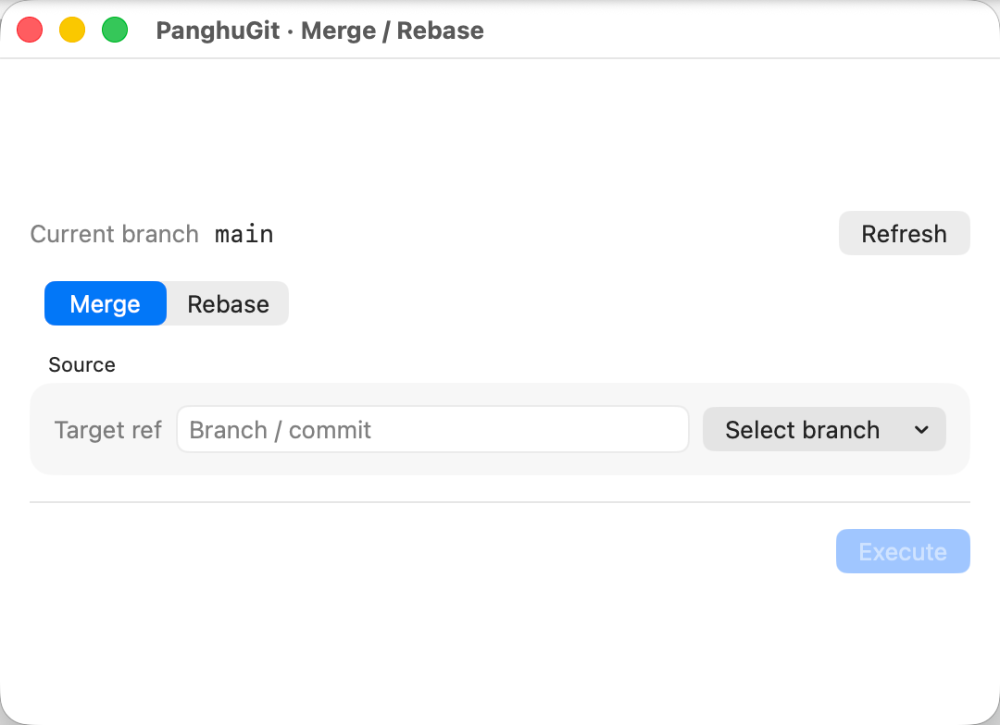

### Features

- View current branch (or detached HEAD state)
- Select and **Checkout** from branch list
- Create new branch and switch (`git checkout -b`)

### Auto Stash

If the working tree has uncommitted changes, PanghuGit automatically stash → checkout → stash pop when switching branches, preventing changes from being lost.

---

## 10. Git Branch Manager

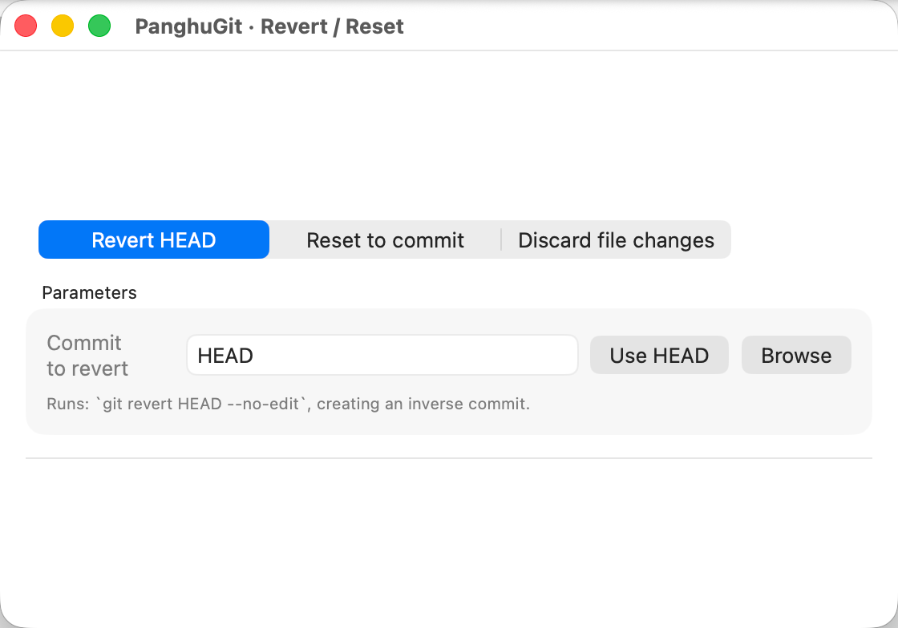

| Operation | Description |
|-----------|-------------|
| Create branch | Enter name + starting point (optional) → `git branch <name> [<from>]` |
| Rename branch | Select source branch + new name → `git branch -m <old> <new>` |
| Delete branch | Select branch → confirm → `git branch -d <name>` |
| Filter | Search box filters branch list |

---

## 11. Git Tags

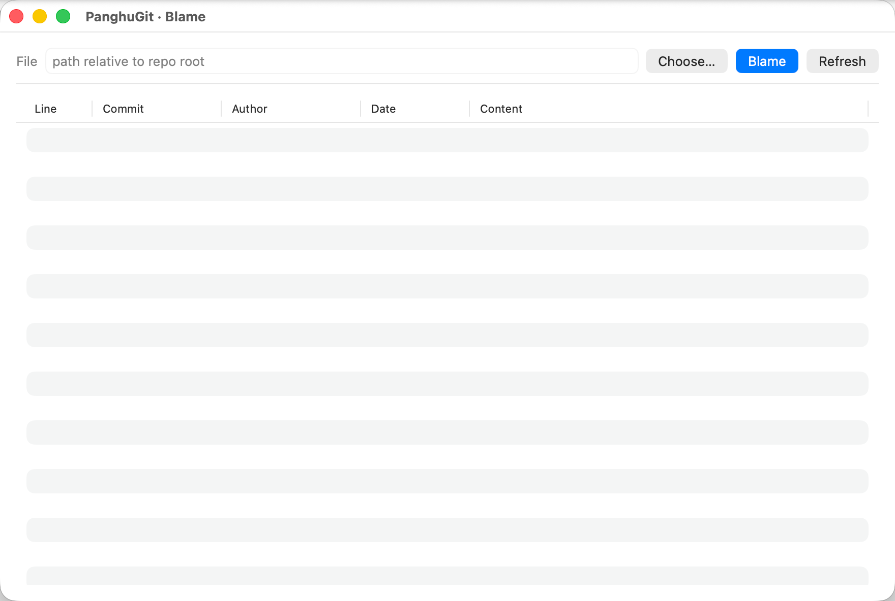

| Operation | Description |
|-----------|-------------|
| View tag list | Name, target SHA, annotation, date |
| Fetch Tags | `git fetch --tags --all`, fetch all remote tags |
| Create tag | Name + target ref + annotation (non-empty creates annotated tag) |
| Delete tag | Select tag → confirm → `git tag -d <name>` |

---

## 12. Git Stash

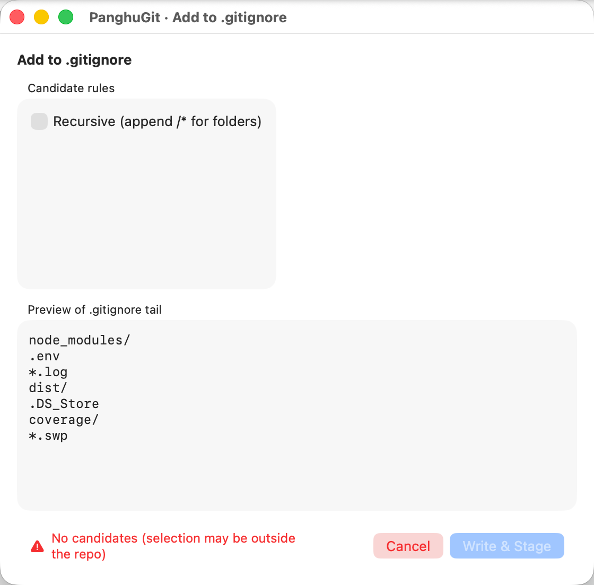

### Operations

| Operation | Git Command | Description |
|-----------|------------|-------------|
| Push new | `git stash push [-m <msg>] [-u] [--keep-index]` | Create new stash |
| Apply | `git stash apply <ref>` | Apply stash (keeps stash record) |
| Pop | `git stash pop <ref>` | Apply and delete stash |
| Drop | `git stash drop <ref>` | Delete stash |
| Create Branch | `git stash branch <name> <ref>` | Create branch from stash |

### Detail View

- Left: File list in stash
- Right: Diff preview of selected file

### Options

| Option | Description |
|--------|-------------|
| Include Untracked | Include untracked files (`-u`) |
| Keep Index | Keep staging area unchanged (`--keep-index`) |

### Conflict Handling

When Apply / Pop results in conflicts, the conflict resolution panel opens automatically.

---

## 13. Git Merge / Rebase

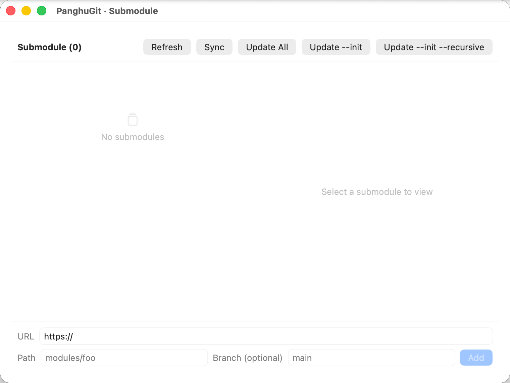

### Operations

| Mode | Git Command |
|------|------------|
| Merge | `git merge <source>` |
| Rebase | `git rebase <source>` |

### Branch Selection

- Manually enter source branch name
- Dropdown menu for quick selection of local/remote branches

### Conflict Detection

- If a merge/rebase is already in progress, a **"Resolve conflicts…"** button appears automatically
- If conflicts occur after an operation, the conflict resolution panel opens automatically

---

## 14. Conflict Resolution

### Conflict File List

- Shows all conflict files with resolved/unresolved markers
- Context menu: Mark Resolved / Open Editor / View Diff

### 3-way Merge View (per file)

```
┌──────────────┬──────────────┬──────────────┐
│   Ours (blue)│  Base (gray) │ Theirs (orange)│
│              │              │              │
│  line from   │  line from   │  line from   │
│  our branch  │  common base │  their branch│
│              │              │              │
│  [Accept ▾]  │  [Accept ▾]  │  [Accept ▾]  │
└──────────────┴──────────────┴──────────────┘
```

### Operations

| Operation | Description |
|-----------|-------------|
| Accept Ours / Base / Theirs | Accept one side's conflict block |
| Edit Manually | Open manual editor |
| Open in FileMerge | Open with macOS FileMerge (opendiff) |
| Undo | Undo last block selection |
| Mark Resolved | Auto `git add` when all blocks are resolved |

### Binary File Conflicts

Shows file sizes for each stage, with Accept buttons to choose which version to keep.

### Continue / Abort

| Operation | Git Command |
|-----------|------------|
| Continue | `git merge --continue` or `git rebase --continue` |
| Abort | `git merge --abort` or `git rebase --abort` |

---

## 15. Git Revert / Reset

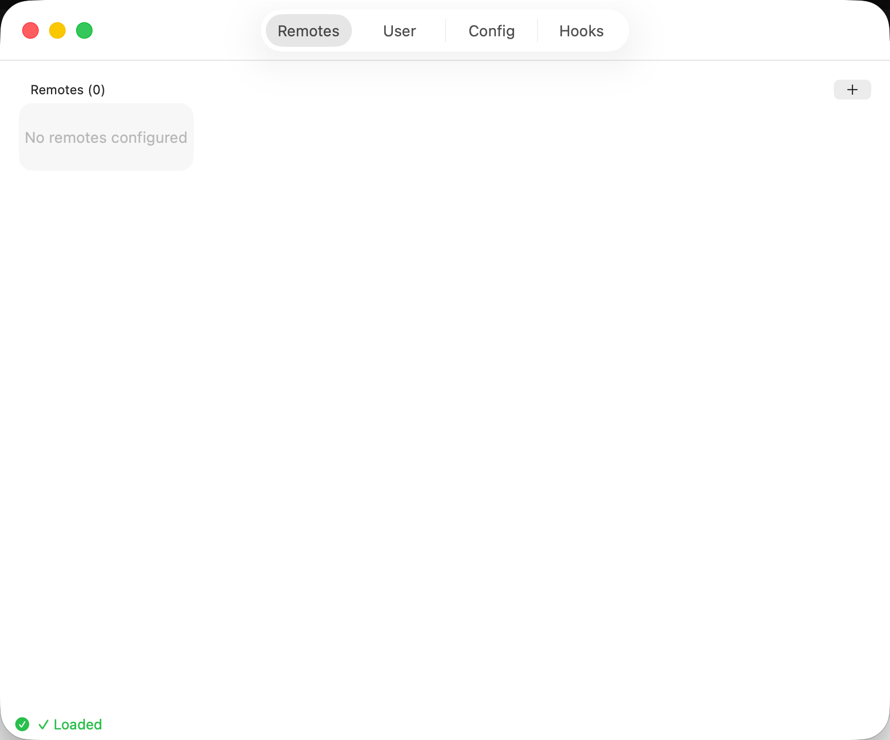

### Modes

| Mode | Git Command | Description |
|------|------------|-------------|
| Revert HEAD | `git revert <target> --no-edit` | Create new commit to undo specified commit |
| Reset to Commit | `git reset --soft\|--mixed\|--hard <target>` | Reset HEAD to specified commit |
| Discard File Changes | `git restore -- <path>` | Discard changes to a single file |

### Reset Modes

| Mode | Description |
|------|-------------|
| --soft | Move HEAD only; staging area and working tree unchanged |
| --mixed | Move HEAD and reset staging area; working tree unchanged |
| --hard | Move HEAD and reset staging area and working tree (**dangerous**) |

### Commit Picker

Click **Browse** to open the commit picker and select a target SHA from the last 100 commits.

---

## 16. Git Init / Clone

### Git Init

- Select target directory
- Execute `git init -b <defaultBranch>` (default branch name configured in Settings, default `main`)
- If target is already a Git repo, automatically switches to Clone mode to prevent accidental operation

### Git Clone

- Enter remote URL, local directory, branch name (optional)
- Execute `git clone <url> [--branch <branch>] -- <target>`

---

## 17. Git Add to .gitignore

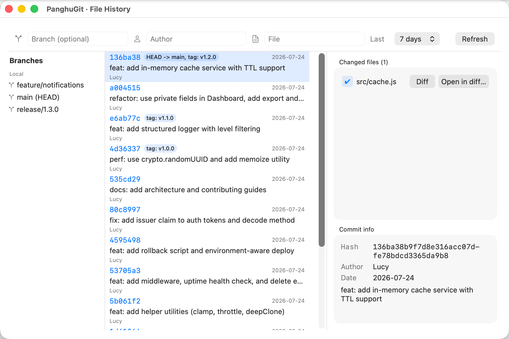

1. Select file/folder in Finder → right-click → **Git Add to .gitignore**
2. Candidate rule list, each can be enabled/disabled
3. **Recursive** option: appends `/*` suffix for directories
4. Preview area shows final .gitignore content
5. **Write & Stage**: Writes .gitignore and auto `git add .gitignore` (auto-staging can be disabled in Settings)

---

## 18. Git Blame

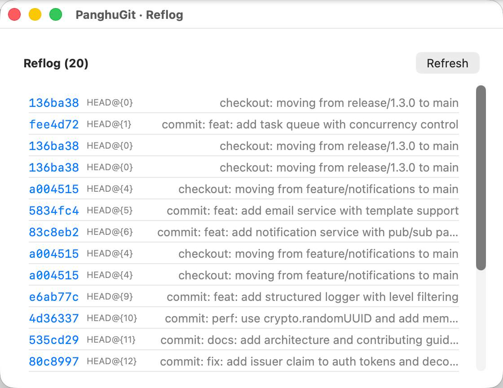

### Interface

| Column | Description |
|--------|-------------|
| Line | Line number |
| Commit | Short SHA with ⤺ button to trace previous revision |
| Author | Author |
| Date | Date |
| Content | Code content; right-click to Blame Previous Revision or copy |

### Revision Navigation

- Click ⤺ button in Commit column: Trace previous revision of that line (`git rev-parse <sha>^`)
- Breadcrumb navigation bar shows trace history; click to go back
- Maximum trace depth: 20 levels

---

## 19. Git Submodule

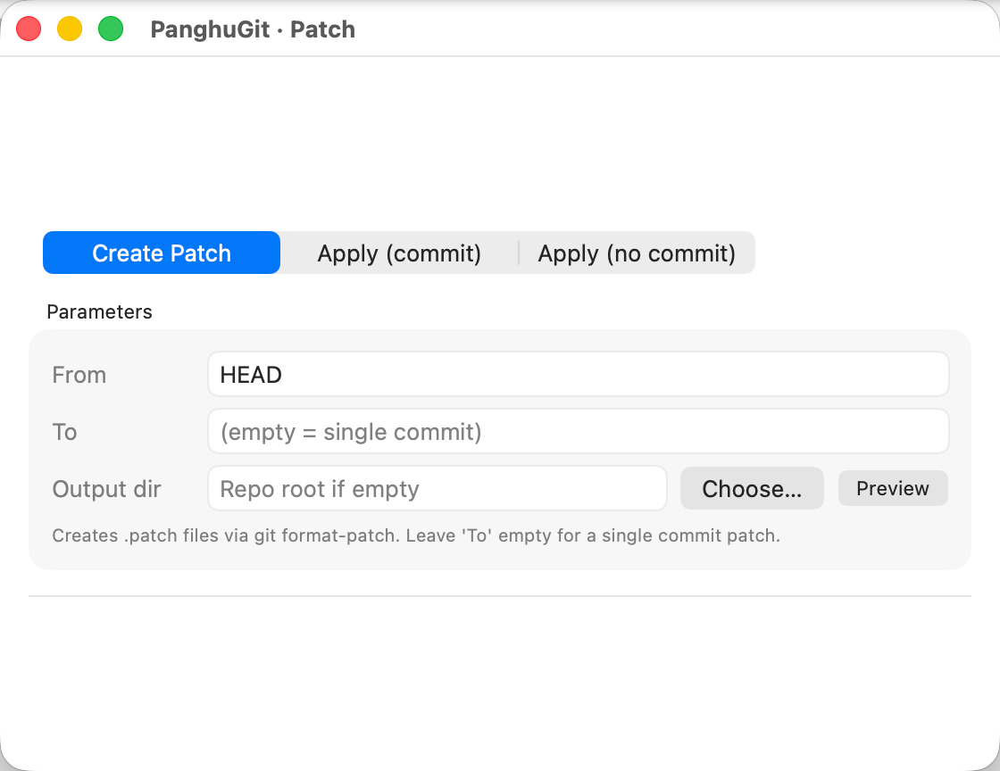

| Operation | Git Command | Description |
|-----------|------------|-------------|
| Add | `git submodule add [-b <branch>] -- <url> <path>` | Add submodule |
| Update | `git submodule update [--init] [--recursive]` | Update submodule |
| Sync | `git submodule sync` | Sync submodule URLs |
| Deinit | `git submodule deinit -f -- <path>` | Deinitialize submodule |

---

## 20. Git Repo Settings

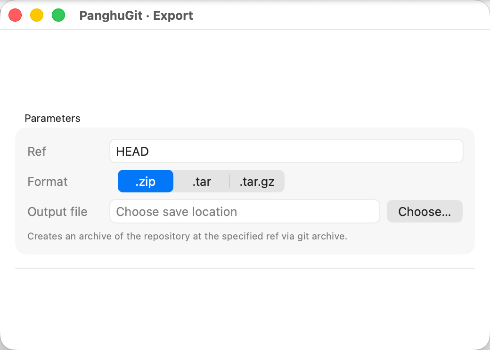

### Remotes Tab

- View/add/delete/modify remote repository URLs

### User Tab

- View and modify repo-level `user.name` / `user.email`
- Saved to repo local config (`--local`)

### Config Tab

- View/edit/add/delete `git config` key-value pairs
- Quick toggles: `pull.rebase`, `core.autocrlf`, `core.ignorecase`
- Raw `.git/config` file preview

### Hooks Tab

- List all hooks in `.git/hooks/`
- Toggle hook enable/disable (rename `.sample` suffix)
- Edit hook script content

---

## 21. Git Reflog

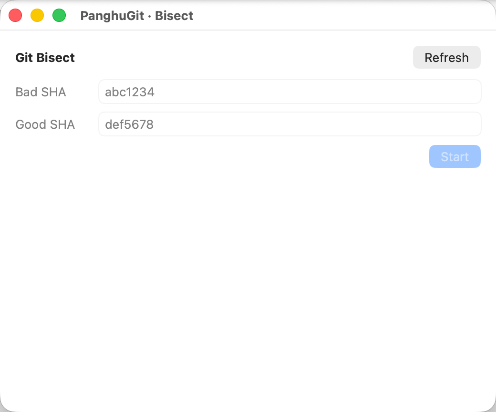

- View reference log (`git reflog`)
- Shows short SHA, reference name, operation description
- Refresh button to reload

---

## 22. Git Patch

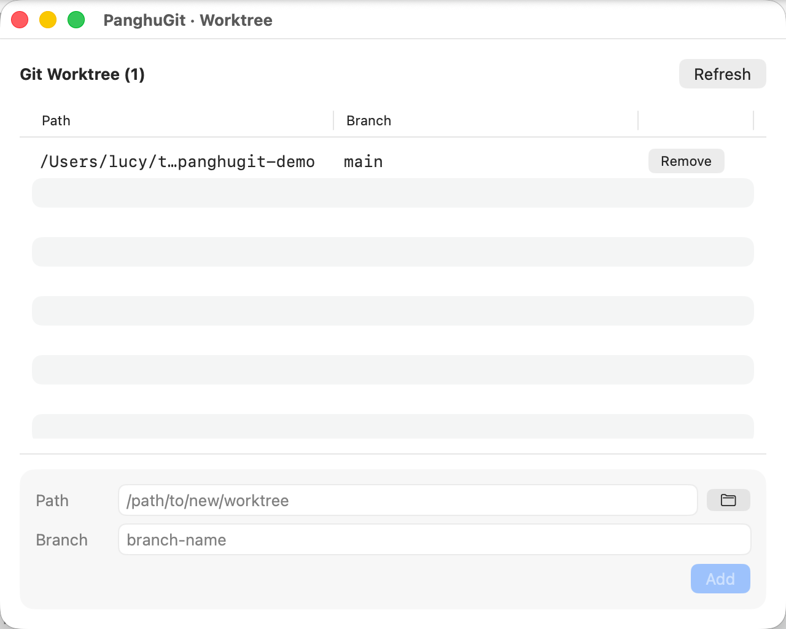

### Modes

| Mode | Description |
|------|-------------|
| Create | Create patch file (`git format-patch`) |
| Apply (commit) | Apply patch and create commit (`git am`) |
| Apply (no commit) | Apply to working tree only (`git apply`) |

### Create Patch

- **From**: Starting reference (required)
- **To**: Ending reference (optional; if empty, generates patch for one commit)
- **Output Dir**: Output directory
- **Preview**: Preview patch content (`git format-patch --stdout`)

### Apply Patch

- **Patch File**: Select .patch file
- **Dry Run**: Test run to check for conflicts (`git apply --check`), no actual application

---

## 23. Git Export

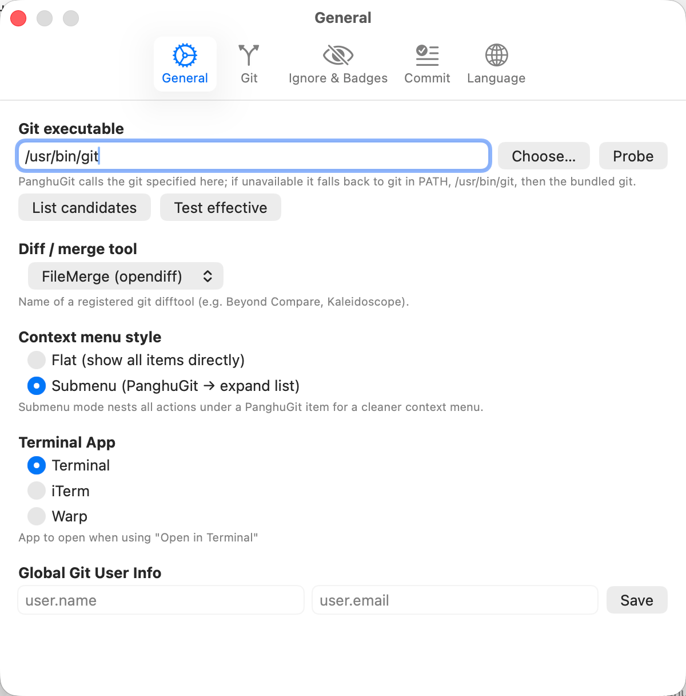

| Field | Description |
|-------|-------------|
| Ref | Tag/branch/commit to archive |
| Format | .zip / .tar / .tar.gz |
| Output | Output file path |

Executes `git archive --format=<format> --output=<path> <ref>`

---

## 24. Git Cleanup

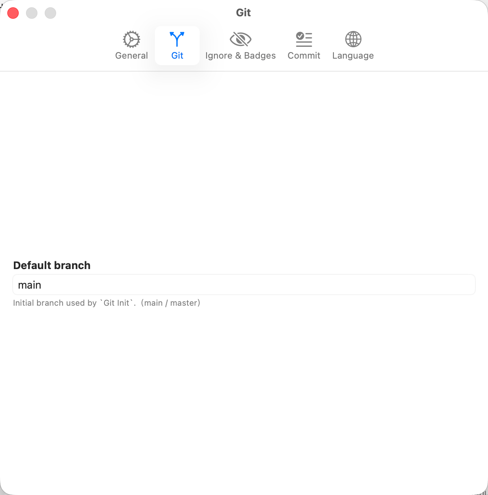

1. List all untracked files and directories
2. Options:
   - **Include directories**: Include directories (`-d`)
   - **Dry run**: Preview only, no actual deletion (`-n`, enabled by default)
3. Confirm to execute `git clean [-n] [-d] -f`

> **Warning:** Disabling Dry run will actually delete files. Use with caution.

---

## 25. Git Bisect

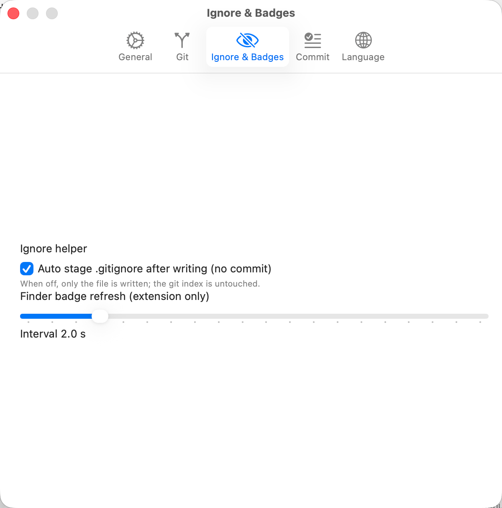

Used to locate the commit that introduced a bug:

1. Enter **Bad SHA** (known broken commit) and **Good SHA** (known working commit)
2. Click **Start** to begin bisect
3. For each tested commit, click **Mark Good** / **Mark Bad** / **Skip**
4. When bisect completes, the first bad commit is displayed
5. **Reset** to end bisect

---

## 26. Git Worktree

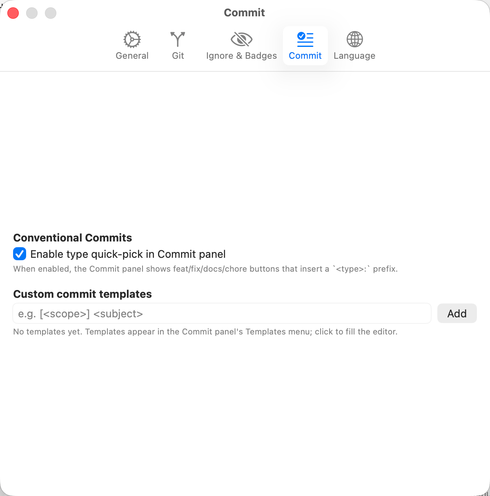

| Operation | Git Command | Description |
|-----------|------------|-------------|
| List | `git worktree list --porcelain` | List all worktrees |
| Add | `git worktree add -- <path> <branch>` | Add worktree |
| Remove | `git worktree remove -- <path>` | Remove worktree |

---

## 27. Global Settings

Open via **Git Settings…** or menu bar **PanghuGit → Settings…**.

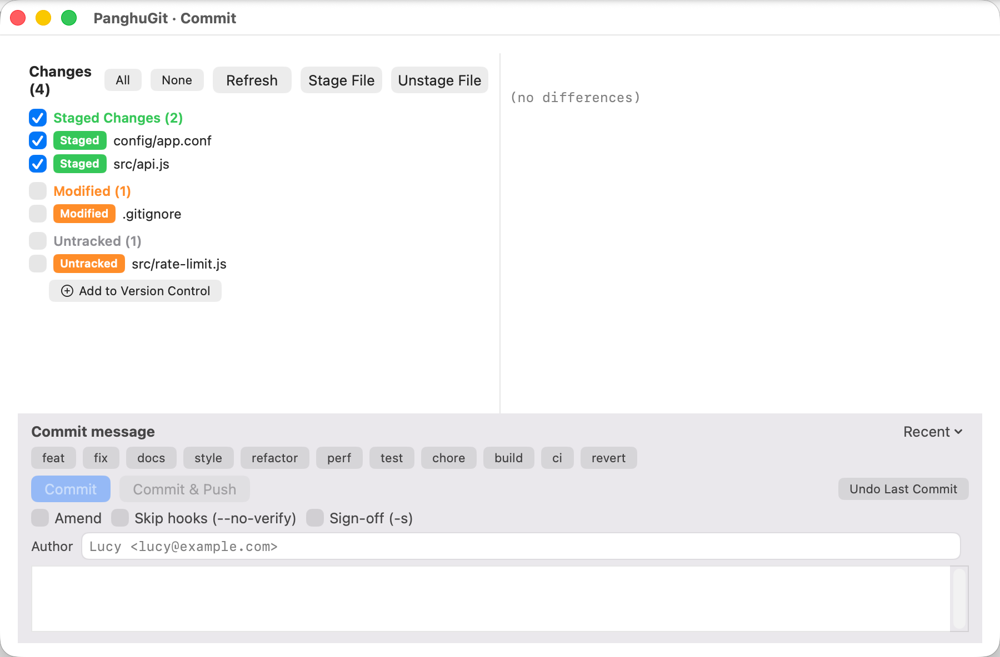

### General Tab

| Setting | Default | Description |
|---------|---------|-------------|
| Git Executable | `/usr/bin/git` | Git executable path |
| Diff/Merge Tool | Built-in | External diff tool: Built-in / FileMerge (opendiff) / Vimdiff / Custom |
| Context Menu Style | Submenu | Context menu style: Flat / Submenu |
| Terminal App | Terminal | Terminal app: Terminal / iTerm / Warp |
| Global User Info | — | Global `user.name` / `user.email` |

#### Git Path Detection

- **Probe**: Test git version at specified path
- **List Candidates**: List all candidate git paths
- **Test Effective**: Show the actually used git path

#### Git Path Priority

1. User-specified path specified by user
2. git in PATH (`which git`)
3. System git (`/usr/bin/git`)
4. Bundled git (`Resources/git/bin/git`)

### Git Tab

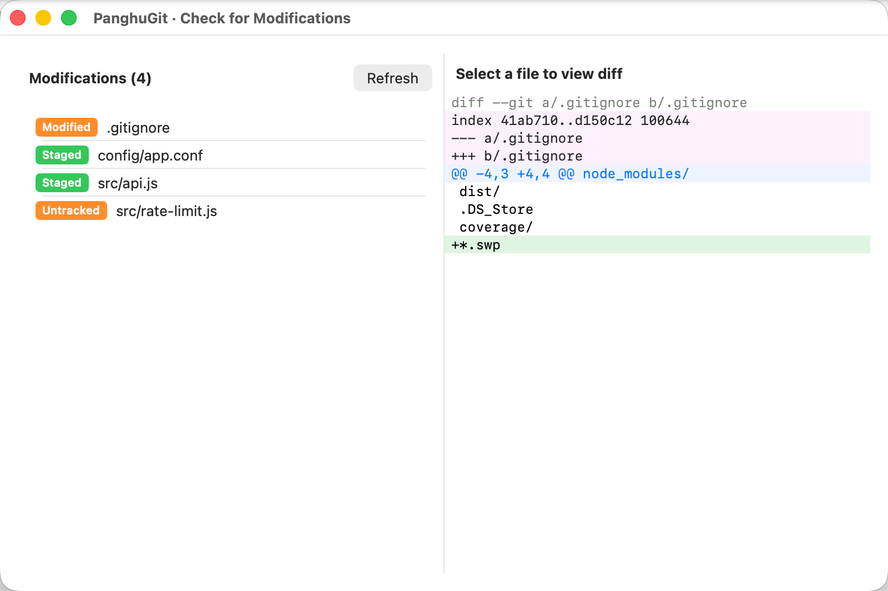

| Setting | Default | Description |
|---------|---------|-------------|
| Default Branch | `main` | Default branch name for `git init` |

### Ignore & Badges Tab

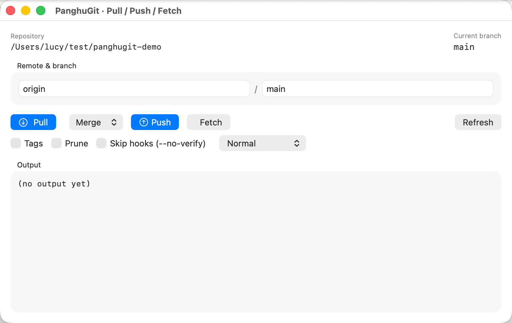

| Setting | Default | Description |
|---------|---------|-------------|
| Auto stage .gitignore | ✅ | Auto `git add` after writing .gitignore |
| Badge refresh interval | 2.0 sec | Finder badge refresh interval (0.5–10 sec) |

### Commit Tab


| Setting | Default | Description |
|---------|---------|-------------|
| Enable Conventional Commits | ✅ | Show commit type quick-select buttons |
| Custom Templates | Empty | Custom commit template list |

### Language Tab

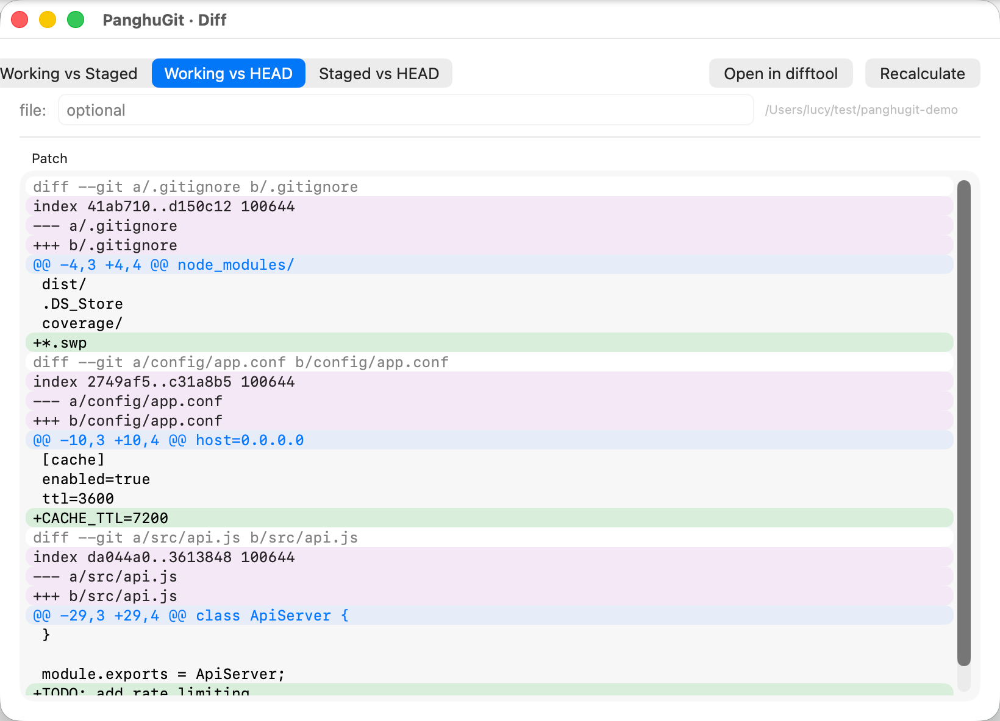

| Setting | Default | Description |
|---------|---------|-------------|
| Interface Language | Follow System | UI language: Follow System / Simplified Chinese / English |

---

## 28. Help Menu

The menu bar includes the following help menu items:

| Menu Item | Action |
|-----------|--------|
| Keyboard Shortcuts | Open keyboard shortcuts reference |
| Documentation | Open GitHub Wiki |
| Report Issue | Open GitHub Issues |
| About PanghuGit | Show about panel |

---

## 29. Command Line Interface

PanghuGit supports command-line invocation (e.g., via `/usr/local/bin/panghugit` symlink).

### Read-only Commands (output to stdout, suitable for scripting)

| Command | Description |
|---------|-------------|
| `version` / `--version` / `-v` | Print version |
| `which <path>` | Print repository root directory for path |
| `branch <path>` | List branches (`*` marks current branch) |
| `tag <path>` | List tags |
| `status-lines <path>` | Output porcelain-format status lines |
| `log <path> [--author <n>] [--branch <r>] [--since <d>] [-n <c>] [--oneline] [--graph]` | Output commit history |
| `diff <path> [--staged\|--cached\|--HEAD\|<a> <b>] [-- <file>]` | Output patch |
| `show <path> <ref> [--stat\|--patch]` | Output commit info + patch |

### GUI Commands (open application windows)

| Command | Description |
|---------|-------------|
| `open <action> <path>` | Open specified window |
| `<action> <path>` | Equivalent to `open <action> <path>` |

---

## 30. Keyboard Shortcuts

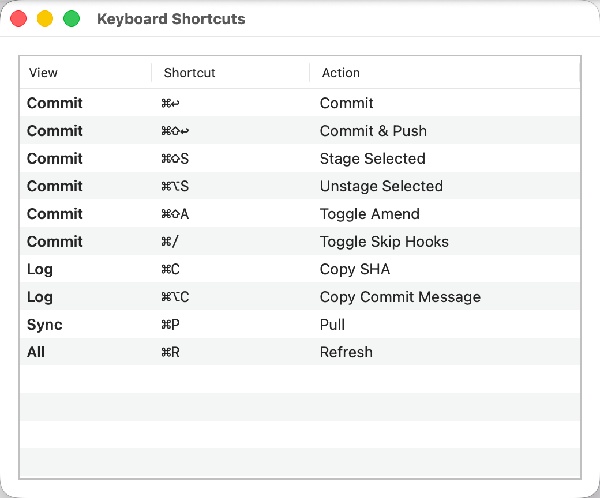

| View | Shortcut | Action |
|------|----------|--------|
| Commit | ⌘↩ | Commit |
| Commit | ⌘⇧↩ | Commit & Push |
| Commit | ⌘⇧S | Stage selected files |
| Commit | ⌘⌥S | Unstage selected files |
| Commit | ⌘⇧A | Toggle Amend |
| Commit | ⌘/ | Toggle Skip Hooks |
| Log | ⌘C | Copy SHA |
| Log | ⌘⌥C | Copy commit message |
| Sync | ⌘P | Pull |
| Global | ⌘R | Refresh |

---

## 31. FAQ

### Q: No PanghuGit in the context menu?

1. Confirm the app is installed in `/Applications/`
2. Go to **System Settings → Privacy & Security → Extensions** and enable PanghuGit Finder Sync
3. Try restarting Finder: run `killall Finder` in terminal

### Q: Badges not showing?

1. Confirm the Finder Sync Extension is enabled
2. Increase Badge refresh interval (Settings → Ignore & Badges)
3. Perform a Git operation to trigger a refresh

### Q: Badges not updated after commit?

Badges update on the next scheduled refresh. You can also manually trigger by adjusting the refresh interval in Settings.

### Q: Push rejected?

The remote has newer commits; you need to Pull first then Push. If you used Amend, you need Force Push (Force with Lease recommended).

### Q: How to handle merge conflicts?

PanghuGit automatically detects conflicts and opens the conflict resolution panel. Use the 3-way merge view to select Ours/Base/Theirs per block, then Continue to complete the merge.

### Q: How to switch the interface language?

Go to **Git Settings → Language** and select Simplified Chinese / English / Follow System. Restart the app after switching.

### Q: How to configure a custom Git path?

Go to **Git Settings → General → Git Executable**, enter the path, and click Probe to verify the version.

### Q: Any issues running directly from DMG?

PanghuGit automatically detects App Translocation on launch and prompts you to drag the app to `/Applications/`. Always launch from `/Applications/`.

---

*PanghuGit v1.0.0 — macOS Finder right-click Git tool*
