# PanghuGit 用户操作手册

> [English](./USER-MANUAL.en.md) | 中文

> **版本：** 1.0.0 | **平台：** macOS 13.0+ | **语言：** 简体中文 / English

PanghuGit 是一款 macOS Finder 右键菜单 Git 工具（类似 Windows 上的 TortoiseGit），通过 Finder Sync 扩展在 Finder 右键菜单中注入 Git 操作，无需离开 Finder 即可完成日常 Git 工作流。

---

## 目录

1. [快速入门](#1-快速入门)
2. [Finder 右键菜单](#2-finder-右键菜单)
3. [文件状态角标](#3-文件状态角标)
4. [Git Commit（提交）](#4-git-commit提交)
5. [Git Diff（差异对比）](#5-git-diff差异对比)
6. [Check for Modifications（修改检查）](#6-check-forA-modifications修改检查)
7. [Git Sync（同步：Pull / Push / Fetch）](#7-git-sync同步pull--push--fetch)
8. [Git Log（提交历史）](#8-git-log提交历史)
9. [Git Switch（切换分支）](#9-git-switch切换分支)
10. [Git Branch Manager（分支管理）](#10-git-branch-manager分支管理)
11. [Git Tags（标签管理）](#11-git-tags标签管理)
12. [Git Stash（暂存）](#12-git-stash暂存)
13. [Git Merge / Rebase（合并 / 变基）](#13-git-merge--rebase合并--变基)
14. [冲突解决](#14-冲突解决)
15. [Git Revert / Reset（回退 / 重置）](#15-git-revert--reset回退--重置)
16. [Git Init / Clone（初始化 / 克隆）](#16-git-init--clone初始化--克隆)
17. [Git Add to .gitignore（忽略文件）](#17-git-add-to-gitignore忽略文件)
18. [Git Blame（逐行追溯）](#18-git-blame逐行追溯)
19. [Git Submodule（子模块）](#19-git-submodule子模块)
20. [Git Repo Settings（仓库设置）](#20-git-repo-settings仓库设置)
21. [Git Reflog（引用日志）](#21-git-reflog引用日志)
22. [Git Patch（补丁）](#22-git-patch补丁)
23. [Git Export（导出归档）](#23-git-export导出归档)
24. [Git Cleanup（清理）](#24-git-c)leanup清理)
25. [Git Bisect（二分查找）](#25-git-bisect二分查找)
26. [Git Worktree（工作树）](#26-git-worktree工作树)
27. [全局设置](#27-全局设置)
28. [帮助菜单](#28-帮助菜单)
29. [命令行接口](#29-命令行接口)
30. [快捷键一览](#30-快捷键一览)
31. [常见问题](#31-常见问题)

---

## 1. 快速入门

### 安装

1. 将 `PanghuGit/` 拖入 `/Applications/`
2. 首次启动时，系统会提示启用 Finder Sync 扩展：
   - 点击 **"启用扩展"** 按钮，或
   - 手动前往 **系统设置 → 隐私与安全性 → 扩展 → 文件提供程序** 中勾选 PanghuGit
3. 启动后 PanghuGit 在菜单栏以辅助模式运行（无 Dock 图标），右键菜单即可使用

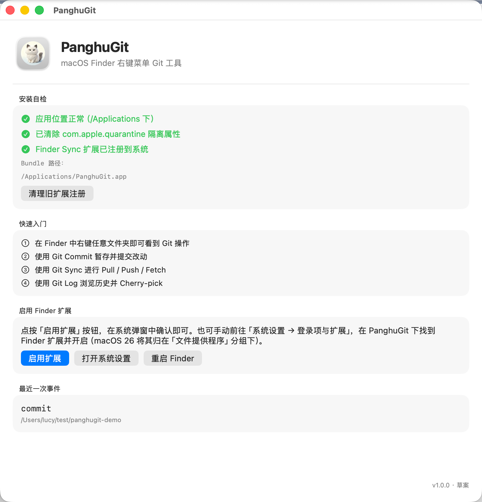

### 基本工作流

| 步骤 | 操作 | 右键菜单项 |
|------|------|-----------|
| 1 | 修改文件后查看变更 | **Git Commit…** |
| 2 | 勾选要提交的文件，填写提交信息 | 点击 **Commit** |
| 3 | 推送到远端 | 点击 **Commit & Push** |
| 4 | 拉取远端更新 | **Git Sync…** → Pull |
| 5 | 查看提交历史 | **Git Log…** |

---

## 2. Finder 右键菜单

在 Finder 中对文件或文件夹右键，即可看到 **PanghuGit** 子菜单（默认）或直接显示的菜单项。


### 菜单样式

在 **Git Settings → General** 中可切换：

| 样式 | 说明 |
|------|------|
| **Submenu**（默认） | 所有操作嵌套在 "PanghuGit" 子菜单下 |
| **Flat** | 所有操作平铺显示在右键菜单中 |

### 菜单项分组

| 菜单项 | 分组 | 显示条件 | 说明 |
|--------|------|----------|------|
| Git Commit… | 仓库操作 | 在 Git 仓库内 | 打开提交面板 |
| Check for Modifications… | 仓库操作 | 在 Git 仓库内 | 查看所有修改文件 |
| Git Sync… | 仓库操作 | 在 Git 仓库内 | Pull / Push / Fetch |
| Git Log… | 仓库操作 | 在 Git 仓库内 | 查看提交历史 |
| Git Diff… | 仓库操作 | 在 Git 仓库内 | 查看工作区差异 |
| Git Switch… | 仓库操作 | 在 Git 仓库内 | 切换分支 |
| Git Merge / Rebase… | 仓库操作 | 在 Git 仓库内 | 合并或变基 |
| Git Revert / Reset… | 仓库操作 | 在 Git 仓库内 | 回退或重置 |
| Git Branch Manager… | 仓库管理 | 在 Git 仓库内 | 管理分支 |
| Git Stash… | 仓库管理 | 在 Git 仓库内 | 暂存管理 |
| Git Tags… | 仓库管理 | 在 Git 仓库内 | 标签管理 |
| Git Submodule… | 仓库管理 | 在 Git 仓库内 | 子模块管理 |
| Git Repo Settings… | 仓库管理 | 在 Git 仓库内 | 仓库配置 |
| Git Reflog… | 仓库管理 | 在 Git 仓库内 | 引用日志 |
| Git Patch… | 仓库管理 | 在 Git 仓库内 | 补丁操作 |
| Git Export… | 仓库管理 | 在 Git 仓库内 | 导出归档 |
| Git Cleanup… | 仓库管理 | 在 Git 仓库内 | 清理未跟踪文件 |
| Git Bisect… | 仓库管理 | 在 Git 仓库内 | 二分查找 |
| Git Worktree… | 仓库管理 | 在 Git 仓库内 | 工作树管理 |
| Git Init Here | 非仓库操作 | **不在** Git 仓库内 | 初始化新仓库 |
| Git Clone… | 非仓库操作 | **不在** Git 仓库内 | 克隆远端仓库 |
| Git Add to .gitignore | 文件操作 | 在仓库内 + 选中文件 | 添加忽略规则 |
| Git Blame… | 文件操作 | 在仓库内 + 选中文件 | 逐行追溯 |
| Git File History… | 文件操作 | 在仓库内 + 选中文件 | 文件历史 |
| Git Settings… | 始终显示 | 任何位置 | 打开全局设置 |

> **注意：** 菜单项末尾的 `…`（省略号）表示该操作会打开新窗口需要进一步输入，没有省略号的为即时操作。

---

## 3. 文件状态角标

PanghuGit 在 Finder 图标上显示 Git 状态角标：

| 角标图标 | 状态 | 含义 |
|----------|------|------|
| ❗ | Modified | 工作区已修改（未暂存） |
| ➕ | Staged / Added | 已暂存待提交 / 新增文件 |
| ❓ | Untracked | 未被 Git 跟踪 |
| ✖ | Conflict | 存在合并冲突 |
| 🚫 | Ignored | 被 .gitignore 忽略 |
| ➖ | Deleted | 已删除 |

### 角标刷新

- 自动定时刷新，间隔可在 **Settings → Ignore & Badges** 中设置（0.5–10 秒，默认 2 秒）
- 执行 Commit / Push / Merge 等操作后自动触发刷新

---

## 4. Git Commit（提交）


### 界面布局

```
┌──────────────────────────────────────────────────┐
│  左侧：变更文件列表    │  右侧：Diff 预览         │
│  ┌─ Staged ────────┐  │                          │
│  │ ☑ file1.swift   │  │  diff --git a/...        │
│  │ ☑ file2.swift   │  │  - old line              │
│  ├─ Modified ──────┤  │  + new line              │
│  │ ☐ file3.swift   │  │                          │
│  ├─ Untracked ─────┤  │  [Stage Hunk] [Unstage]  │
│  │ ☐ newfile.swift │  │                          │
│  └─────────────────┘  │                          │
├──────────────────────────────────────────────────┤
│  [feat][fix][docs]...  提交信息编辑器              │
│  Templates ▾ Recent ▾                           │
│  ┌─────────────────────────────────────────────┐│
│  │ feat: add user authentication               ││
│  │                                             ││
│  │ Implement JWT-based auth...                 ││
│  └─────────────────────────────────────────────┘│
│  Author: [                      ] ▾              │
│  ☐ Amend  ☐ Skip hooks  ☐ Sign-off              │
│  [Commit ⌘↩]  [Commit & Push ⌘⇧↩]  [Undo]     │
└──────────────────────────────────────────────────┘
```

### 文件操作

| 操作 | 说明 |
|------|------|
| 勾选/取消勾选 | 暂存/取消暂存文件（`git add` / `git reset HEAD`） |
| 点击文件 | 查看该文件的 diff |
| 双击文件 | 用默认应用打开文件 |
| 右键文件 | 上下文菜单：Open / Open With / Show in Finder / Stage / Unstage / Restore / Delete / Difftool |

### Hunk 级暂存

在 diff 预览中，可以使用 **Stage Hunk** / **Unstage Hunk** 按钮对单个 diff hunk 进行暂存或取消暂存，而非整个文件。

### Conventional Commits

当 **Settings → Commit → Enable Conventional Commits** 开启时，提交信息编辑器上方显示类型快捷按钮：

`feat` `fix` `docs` `style` `refactor` `perf` `test` `chore` `build` `ci` `revert`

点击按钮会在提交信息开头插入 `<type>:` 前缀。

### 提交模板

在 **Settings → Commit → Custom Templates** 中添加模板，提交时可通过 **Templates** 下拉菜单选用。

### 作者字段

- 留空：使用仓库或全局 git 用户配置
- 输入自定义格式：`Name <email>`，传递 `--author` 参数
- 下拉建议：从仓库历史中自动补全共同作者

### 选项说明

| 选项 | Git 参数 | 说明 |
|------|----------|------|
| Amend | `--amend` | 修正上一次提交 |
| Skip hooks | `--no-verify` | 跳过 git hooks |
| Sign-off | `-s` | 添加 `Signed-off-by` 签名 |

### Amend + Push

当 Amend 和 Push 同时使用时，需要强制推送。PanghuGit 会弹出确认对话框，提供 **Force with Lease**（推荐）和 **Normal** 两种选项。

### 快捷键

| 快捷键 | 操作 |
|--------|------|
| ⌘↩ | Commit |
| ⌘⇧↩ | Commit & Push |
| ⌘⇧S | Stage 选中文件 |
| ⌘⌥S | Unstage 选中文件 |
| ⌘⇧A | 切换 Amend |
| ⌘/ | 切换 Skip Hooks |
| ⌘R | 刷新 |

---

## 5. Git Diff（差异对比）


### 模式选择

通过顶部分段控制器切换：

| 模式 | Git 命令 | 说明 |
|------|----------|------|
| Working vs Staged | `git diff -- <file>` | 工作区与暂存区的差异 |
| Working vs HEAD | `git diff HEAD -- <file>` | 工作区与 HEAD 的差异 |
| Staged vs HEAD | `git diff --staged HEAD -- <file>` | 暂存区与 HEAD 的差异 |

### 其他功能

- **文件路径筛选**：顶部文件路径字段可筛选特定文件
- **Open in Difftool**：使用外部 diff 工具打开（在 Settings 中配置）
- **颜色编码**：添加行（绿色）、删除行（红色）、上下文行（默认色）

---

## 6. Check for Modifications（修改检查）

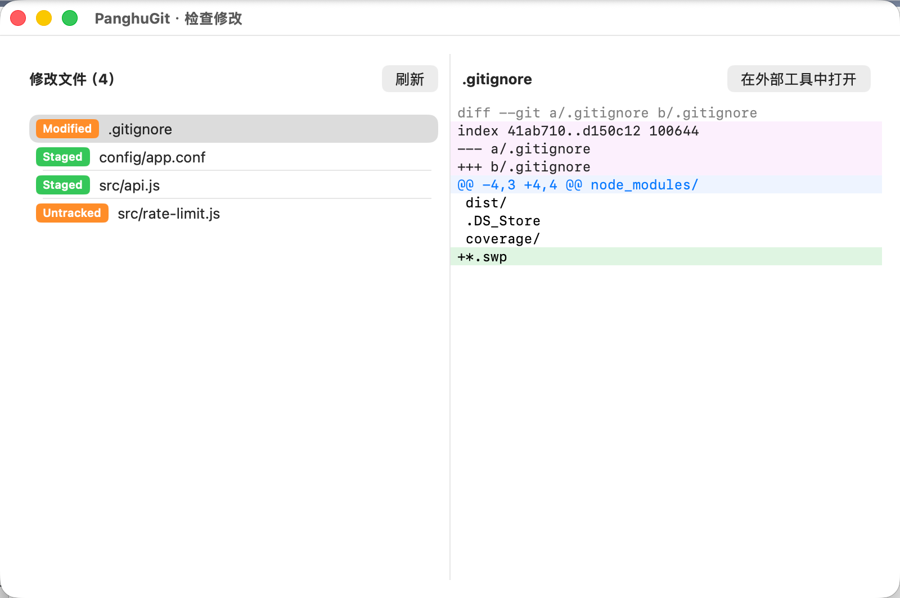

快速查看所有已修改/已暂存/未跟踪文件的概览：

- **左侧**：文件列表，带状态角标图标
- **右侧**：选中文件的 diff 预览
- 右键文件可执行 Stage / Unstage / Restore / Delete 等操作

---

## 7. Git Sync（同步：Pull / Push / Fetch）

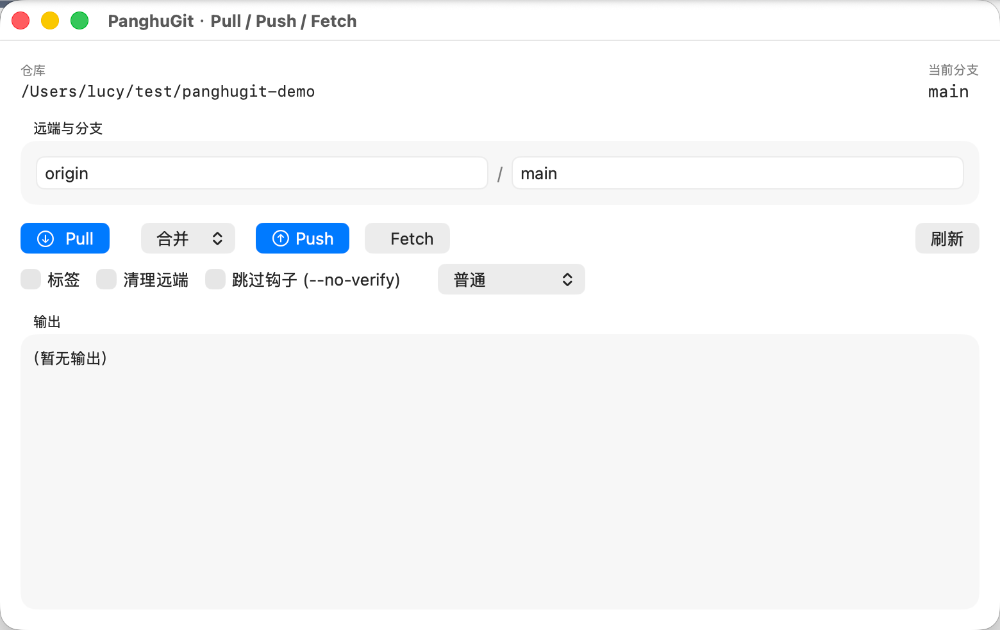

### 界面布局

```
┌──────────────────────────────────────────────────┐
│  Repository: /path/to/repo                       │
│  Current Branch: main                            │
│                                                  │
│  Remote: [origin    ]   Branch: [main    ] [当前] │
│                                                  │
│  [⬇ Pull ⌘P]  [⬆ Push]  [⬇ Fetch]            │
│  Pull: [Merge | Rebase]   Force: [Normal ▾]      │
│  ☐ Tags   ☐ Prune   ☐ Skip hooks                │
│                                                  │
│  ┌─ Output ─────────────────────────────────────┐│
│  │ Already up to date.                          ││
│  └──────────────────────────────────────────────┘│
└──────────────────────────────────────────────────┘
```

### 操作说明

| 操作 | Git 命令 | 说明 |
|------|----------|------|
| Pull | `git pull <remote> <branch> [--rebase]` | 拉取并合并/变基 |
| Push | `git push <remote> <branch> [--force\|--force-with-lease] [--tags] [--no-verify]` | 推送到远端 |
| Fetch | `git fetch <remote> <branch> [--prune]` | 仅拉取不合并 |

### 选项说明

| 选项 | 说明 |
|------|------|
| Pull: Merge / Rebase | 选择合并策略 |
| Force: Normal / Force / Force with Lease | 推送强制模式 |
| Tags | 推送时包含标签（`--tags`） |
| Prune | 拉取时清理已删除的远端分支（`--prune`） |
| Skip hooks | 跳过 git hooks（`--no-verify`） |
| "Use Current" | 自动填入当前分支名 |

### 强制推送确认

选择 Force 或 Force with Lease 时，PanghuGit 会先计算远端将被覆盖的提交数量并弹出确认对话框。

---

## 8. Git Log（提交历史）


### 界面布局

```
┌────────┬──────────────────────┬──────────────────┐
│ 分支   │ 提交记录             │ 详情面板         │
│        │                      │                  │
│ Local  │ abc1234 (HEAD→main)  │ Changed Files(3)│
│ * main │ def5678              │  M  file1.swift │
│ dev    │ ghi9012              │  A  file2.swift │
│        │                      │  D  file3.swift │
│ Remote │                      │                  │
│ origin │                      │ Commit Info      │
│  main  │                      │ Hash: abc123... │
│  dev   │                      │ Author: Lucy    │
│        │ [Load More]          │ Date: 2026-07-22│
└────────┴──────────────────────┴──────────────────┘
```

### 筛选栏

| 筛选项 | 说明 |
|--------|------|
| Branch | 按分支名筛选 |
| Author | 按作者筛选 |
| File | 按文件路径筛选 |
| Since | 时间范围：7 天 / 30 天 / 90 天 / 全部 |
| Follow Renames | 跟随文件重命名（`--follow`），仅文件筛选时可用 |

### 详情面板

- 仅在点击某条提交记录后显示
- **Changed Files**：列出该提交的变更文件，带状态图标
  - 双击文件 → 用外部 difftool 打开
  - 右键 → View at This Revision / Copy File Path
  - **Diff** 按钮 → 在新窗口打开 diff
  - **Difftool** 按钮 → 用外部工具打开
- **Commit Info**：完整 SHA、作者、日期、提交信息

### 多选操作

- **⌘ + 点击**：多选提交
- 选中 ≥ 2 条：**Cherry-pick Range**
- 选中 = 2 条：**Diff A…B**

### 右键上下文菜单

| 菜单项 | 快捷键 | 说明 |
|--------|--------|------|
| Copy SHA | ⌘C | 复制完整 SHA |
| Copy Branch Name | | 复制分支名 |
| Copy Commit Message | ⌘⌥C | 复制提交信息 |
| Checkout This Commit | | 检出到该提交 |
| Create Tag Here… | | 在此提交创建标签 |
| Cherry-pick | | Cherry-pick 该提交 |
| Cherry-pick Range | | Cherry-pick 多选提交（按时间顺序） |
| Diff A…B | | 对比两条提交 |
| Revert This Commit | | `git revert --no-edit` |
| Reset to This Commit | | 子菜单：--soft / --mixed / --hard |

### 分页

每次加载 50 条提交，底部显示 **Load More** 按钮加载更多。

---

## 9. Git Switch（切换分支）

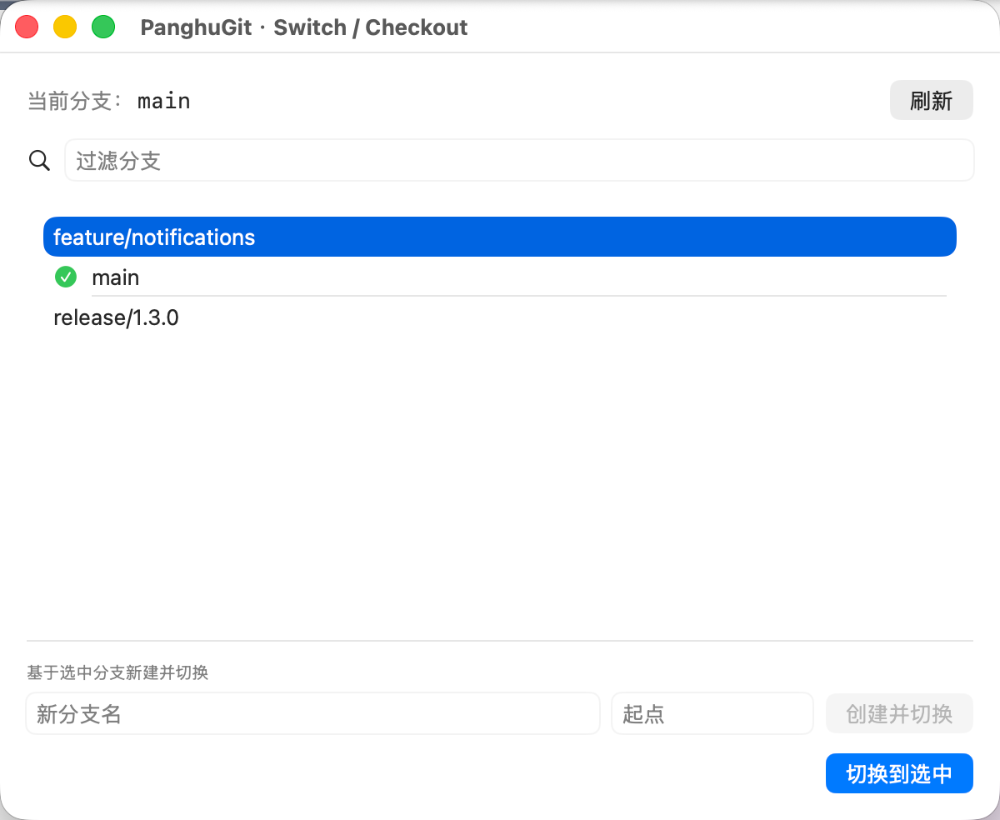

### 功能

- 查看当前分支（或 detached HEAD 状态）
- 从分支列表中选择并 **Checkout**
- 创建新分支并切换（`git checkout -b`）

### 自动 Stash

如果工作区有未提交的修改，切换分支时 PanghuGit 会自动 stash → checkout → stash pop，避免修改丢失。

---

## 10. Git Branch Manager（分支管理）

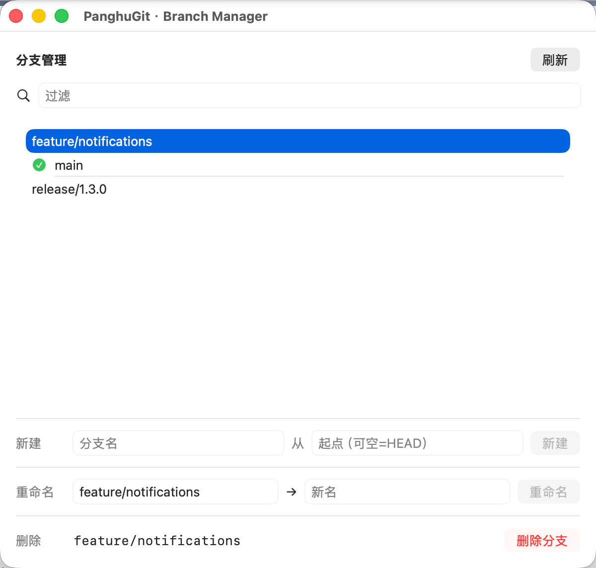

| 操作 | 说明 |
|------|------|
| 创建分支 | 输入名称 + 起始点（可选）→ `git branch <name> [<from>]` |
| 重命名分支 | 选择源分支 + 新名称 → `git branch -m <old> <new>` |
| 删除分支 | 选择分支 → 确认 → `git branch -d <name>` |
| 筛选 | 搜索框过滤分支列表 |

---

## 11. Git Tags（标签管理）

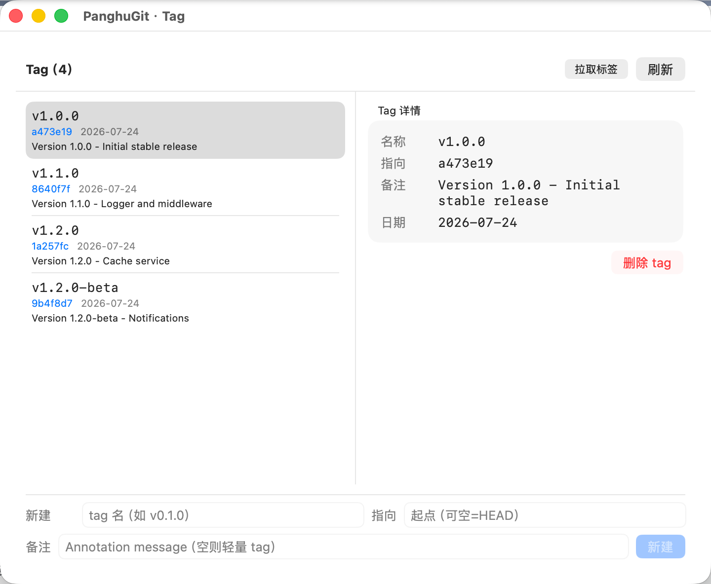

| 操作 | 说明 |
|------|------|
| 查看标签列表 | 名称、指向 SHA、注释、日期 |
| Fetch Tags | `git fetch --tags --all`，拉取所有远端标签 |
| 创建标签 | 名称 + 目标引用 + 注释信息（非空则为 annotated tag） |
| 删除标签 | 选择标签 → 确认 → `git tag -d <name>` |

---

## 12. Git Stash（暂存）

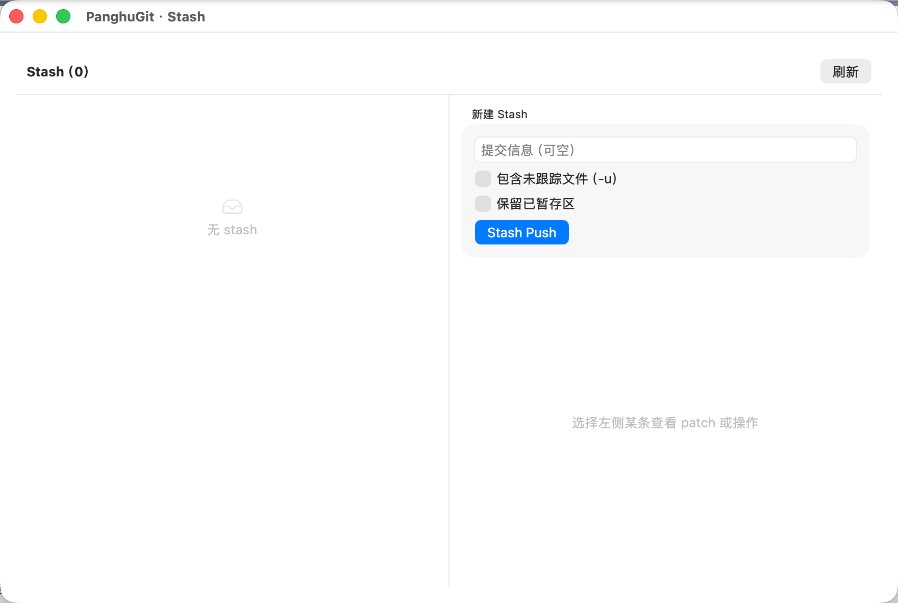

### 操作

| 操作 | Git 命令 | 说明 |
|------|----------|------|
| Push new | `git stash push [-m <msg>] [-u] [--keep-index]` | 创建新 stash |
| Apply | `git stash apply <ref>` | 应用 stash（保留 stash 记录） |
| Pop | `git stash pop <ref>` | 应用并删除 stash |
| Drop | `git stash drop <ref>` | 删除 stash |
| Create Branch | `git stash branch <name> <ref>` | 从 stash 创建分支 |

### 详情查看

- 左侧：stash 中的文件列表
- 右侧：选中文件的 diff 预览

### 选项

| 选项 | 说明 |
|------|------|
| Include Untracked | 包含未跟踪文件（`-u`） |
| Keep Index | 保持暂存区不变（`--keep-index`） |

### 冲突处理

Apply / Pop 发生冲突时，自动打开冲突解决面板。

---

## 13. Git Merge / Rebase（合并 / 变基）

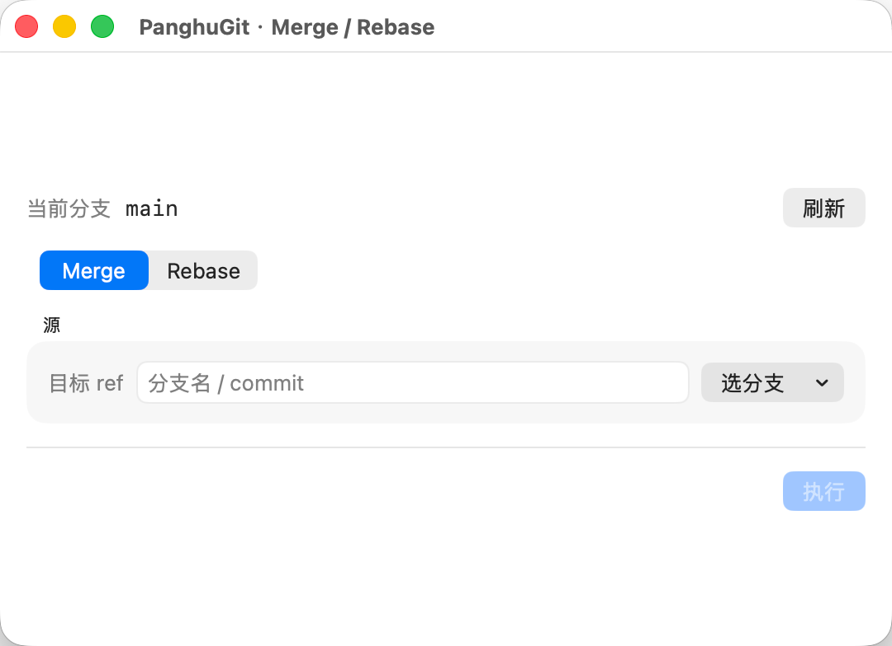

### 操作

| 模式 | Git 命令 |
|------|----------|
| Merge | `git merge <source>` |
| Rebase | `git rebase <source>` |

### 分支选择

- 手动输入源分支名
- 下拉菜单快速选择本地/远端分支

### 冲突检测

- 如果当前已在 merge/rebase 进行中，自动显示 **"Resolve conflicts…"** 按钮
- 操作后若产生冲突，自动跳转到冲突解决面板

---

## 14. 冲突解决

### 冲突文件列表

- 显示所有冲突文件，已解决/未解决标记
- 右键菜单：Mark Resolved / Open Editor / View Diff

### 三方合并视图（单文件）

```
┌──────────────┬──────────────┬──────────────┐
│   Ours (蓝)  │  Base (灰)   │ Theirs (橙)  │
│              │              │              │
│  line from   │  line from   │  line from   │
│  our branch  │  common base │  their branch│
│              │              │              │
│  [Accept ▾]  │  [Accept ▾]  │  [Accept ▾]  │
└──────────────┴──────────────┴──────────────┘
```

### 操作

| 操作 | 说明 |
|------|------|
| Accept Ours / Base / Theirs | 接受某一方的冲突块 |
| Edit Manually | 打开手动编辑器 |
| Open in FileMerge | 用 macOS FileMerge (opendiff) 打开 |
| Undo | 撤销上一次块选择 |
| Mark Resolved | 所有块解决后自动 `git add` |

### 二进制文件冲突

显示各阶段文件大小，提供 Accept 按钮选择保留哪个版本。

### 继续/中止

| 操作 | Git 命令 |
|------|----------|
| Continue | `git merge --continue` 或 `git rebase --continue` |
| Abort | `git merge --abort` 或 `git rebase --abort` |

---

## 15. Git Revert / Reset（回退 / 重置）

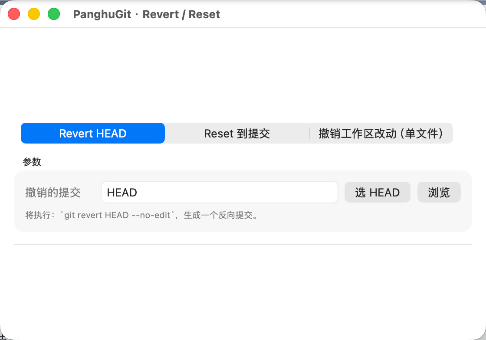

### 模式

| 模式 | Git 命令 | 说明 |
|------|----------|------|
| Revert HEAD | `git revert <target> --no-edit` | 创建新提交撤销指定提交 |
| Reset to Commit | `git reset --soft\|--mixed\|--hard <target>` | 重置 HEAD 到指定提交 |
| Discard File Changes | `git restore -- <path>` | 丢弃单个文件的修改 |

### 重置模式

| 模式 | 说明 |
|------|------|
| --soft | 仅移动 HEAD，暂存区和工作区不变 |
| --mixed | 移动 HEAD 并重置暂存区，工作区不变 |
| --hard | 移动 HEAD 并重置暂存区和工作区（**危险**） |

### Commit Picker

点击 **Browse** 按钮打开提交选择器，从最近 100 条提交中选择目标 SHA。

---

## 16. Git Init / Clone（初始化 / 克隆）

### Git Init

- 选择目标目录
- 执行 `git init -b <defaultBranch>`（默认分支名在 Settings 中配置，默认 `main`）
- 如果目标已是 Git 仓库，自动切换到 Clone 模式避免误操作

### Git Clone

- 输入远端 URL、本地目录、分支名（可选）
- 执行 `git clone <url> [--branch <branch>] -- <target>`

---

## 17. Git Add to .gitignore（忽略文件）

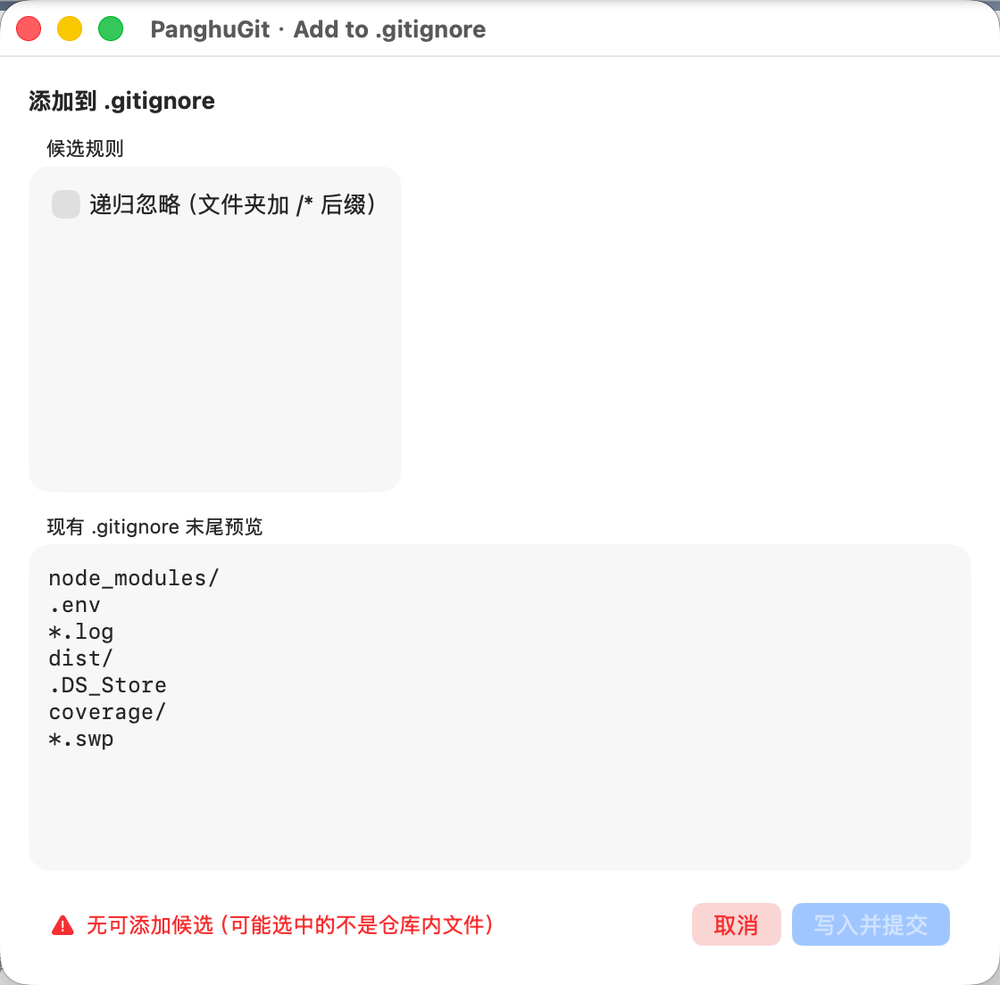

1. 从 Finder 选中文件/文件夹后右键 → **Git Add to .gitignore**
2. 候选规则列表，每条可启用/禁用
3. **Recursive** 选项：对目录追加 `/*` 后缀
4. 预览区显示 .gitignore 最终内容
5. **Write & Stage**：写入 .gitignore 并自动 `git add .gitignore`（可在 Settings 中关闭自动暂存）

---

## 18. Git Blame（逐行追溯）

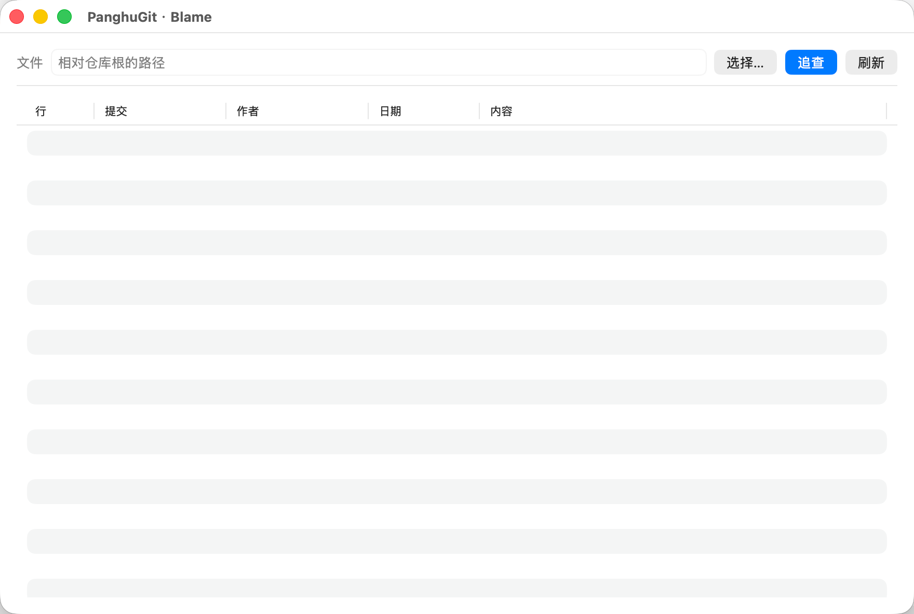

### 界面

| 列 | 说明 |
|----|------|
| Line | 行号 |
| Commit | 提交短 SHA，带 ⤺ 按钮可追溯上一版本 |
| Author | 作者 |
| Date | 日期 |
| Content | 代码内容，右键可 Blame Previous Revision 或复制 |

### 版本导航

- 点击提交列的 ⤺ 按钮：追溯该行的上一版本（`git rev-parse <sha>^`）
- 面包屑导航栏显示追溯历史，点击可返回
- 最大追溯深度：20 层

---

## 19. Git Submodule（子模块）

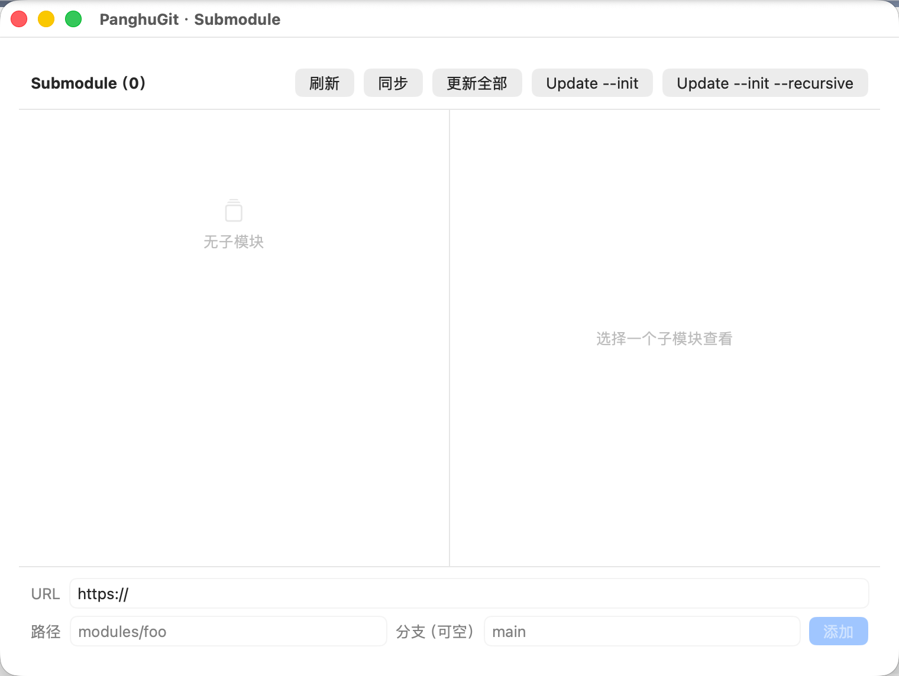

| 操作 | Git 命令 | 说明 |
|------|----------|------|
| Add | `git submodule add [-b <branch>] -- <url> <path>` | 添加子模块 |
| Update | `git submodule update [--init] [--recursive]` | 更新子模块 |
| Sync | `git submodule sync` | 同步子模块 URL |
| Deinit | `git submodule deinit -f -- <path>` | 取消初始化 |

---

## 20. Git Repo Settings（仓库设置）

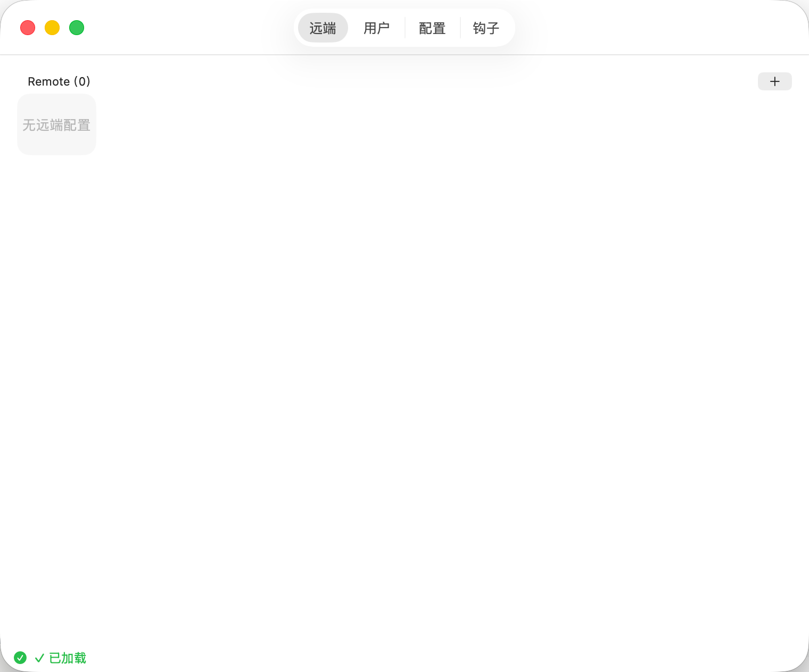

### Remotes 标签页

- 查看/添加/删除/修改远端仓库 URL

### User 标签页

- 查看和修改仓库级别的 `user.name` / `user.email`
- 保存到仓库本地配置（`--local`）

### Config 标签页

- 查看/编辑/添加/删除 `git config` 键值对
- 快捷开关：`pull.rebase`、`core.autocrlf`、`core.ignorecase`
- 原始 `.git/config` 文件预览

### Hooks 标签页

- 列出 `.git/hooks/` 中的所有 hook
- 切换 hook 启用/禁用（重命名 `.sample` 后缀）
- 编辑 hook 脚本内容

---

## 21. Git Reflog（引用日志）

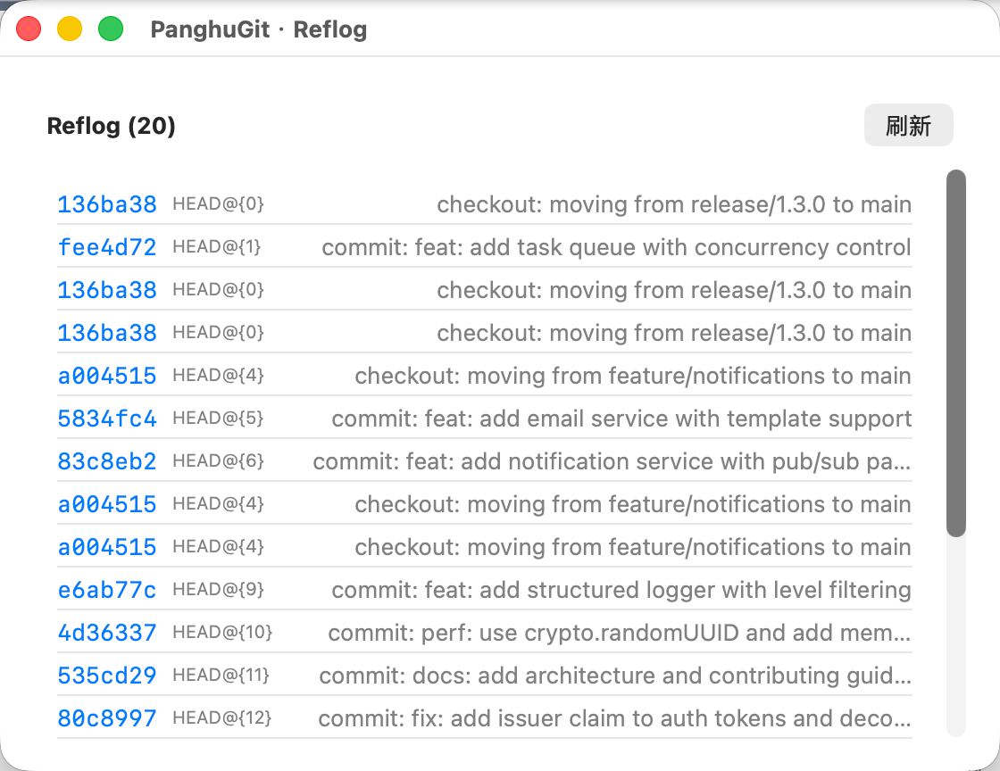

- 查看引用日志（`git reflog`）
- 显示短 SHA、引用名、操作描述
- 刷新按钮重新加载

---

## 22. Git Patch（补丁）

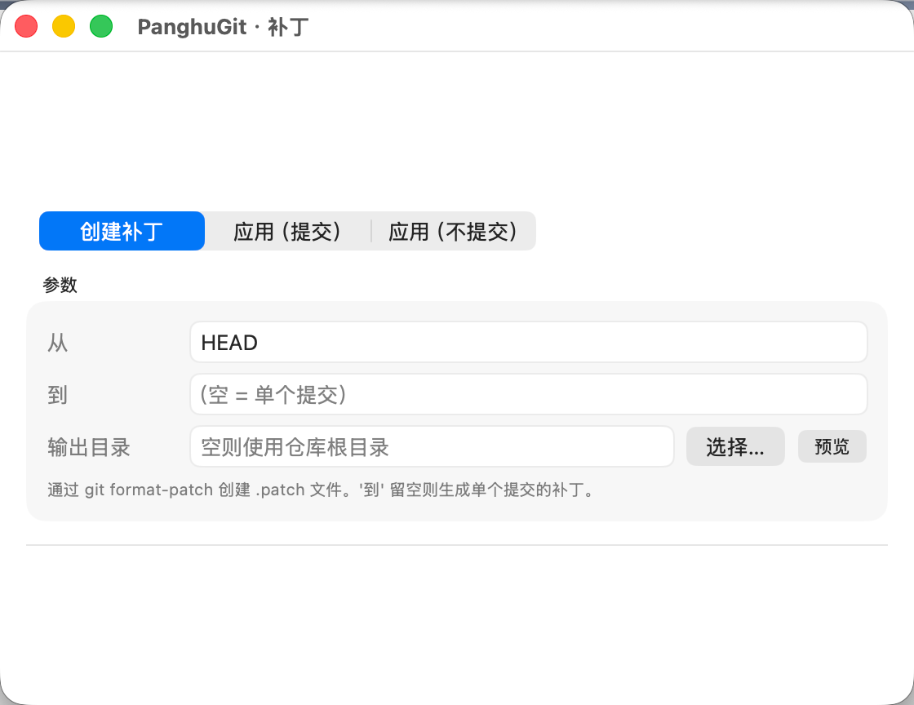

### 模式

| 模式 | 说明 |
|------|------|
| Create | 创建补丁文件（`git format-patch`） |
| Apply (commit) | 应用补丁并创建提交（`git am`） |
| Apply (no commit) | 仅应用到工作区（`git apply`） |

### Create Patch

- **From**：起始引用（必填）
- **To**：结束引用（可选，留空则只生成 From 的一个提交补丁）
- **Output Dir**：输出目录
- **Preview**：预览补丁内容（`git format-patch --stdout`）

### Apply Patch

- **Patch File**：选择 .patch 文件
- **Dry Run**：试运行检查冲突（`git apply --check`），不实际应用

---

## 23. Git Export（导出归档）

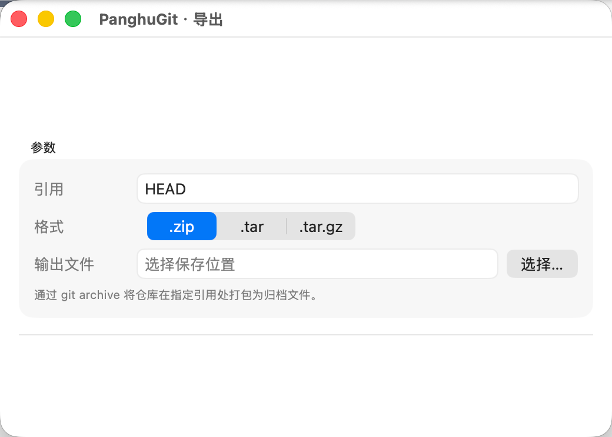

| 项 | 说明 |
|----|------|
| Ref | 要归档的标签/分支/提交 |
| Format | .zip / .tar / .tar.gz |
| Output | 输出文件路径 |

执行 `git archive --format=<format> --output=<path> <ref>`

---

## 24. Git Cleanup（清理）

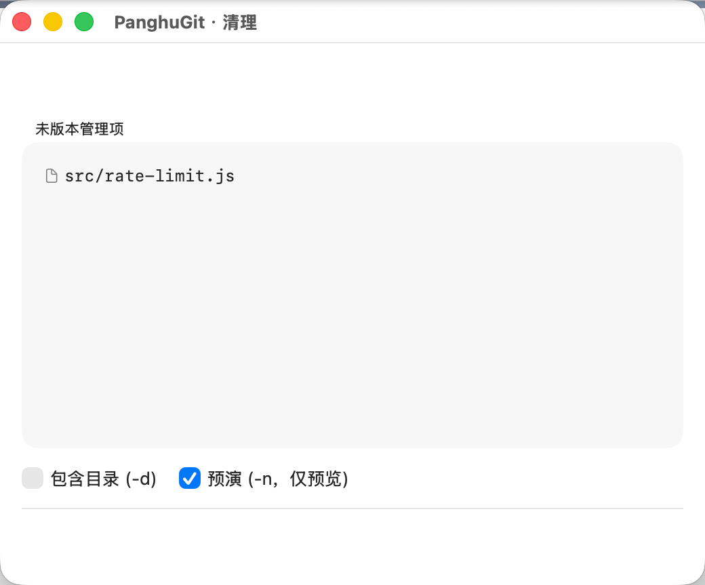

1. 列出所有未跟踪文件和目录
2. 选项：
   - **Include directories**：包含目录（`-d`）
   - **Dry run**：仅预览不实际删除（`-n`，默认开启）
3. 确认后执行 `git clean [-n] [-d] -f`

> **警告：** 关闭 Dry run 后会实际删除文件，请谨慎操作。

---

## 25. Git Bisect（二分查找）

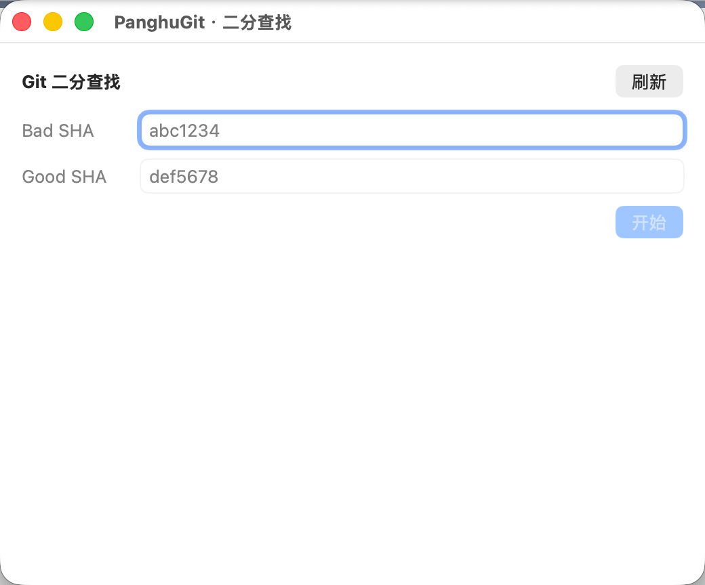

用于定位引入 Bug 的提交：

1. 输入 **Bad SHA**（已知有问题的提交）和 **Good SHA**（已知正常的提交）
2. 点击 **Start** 开始 bisect
3. 对每个测试的提交点击 **Mark Good** / **Mark Bad** / **Skip**
4. Bisect 完成后显示第一个问题提交
5. **Reset** 结束 bisect

---

## 26. Git Worktree（工作树）

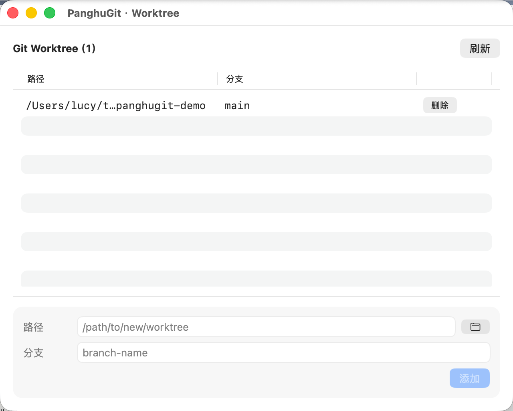

| 操作 | Git 命令 | 说明 |
|------|----------|------|
| List | `git worktree list --porcelain` | 列出所有工作树 |
| Add | `git worktree add -- <path> <branch>` | 添加工作树 |
| Remove | `git worktree remove -- <path>` | 删除工作树 |

---

## 27. 全局设置

通过 **Git Settings…** 或菜单栏 **PanghuGit → Settings…** 打开。

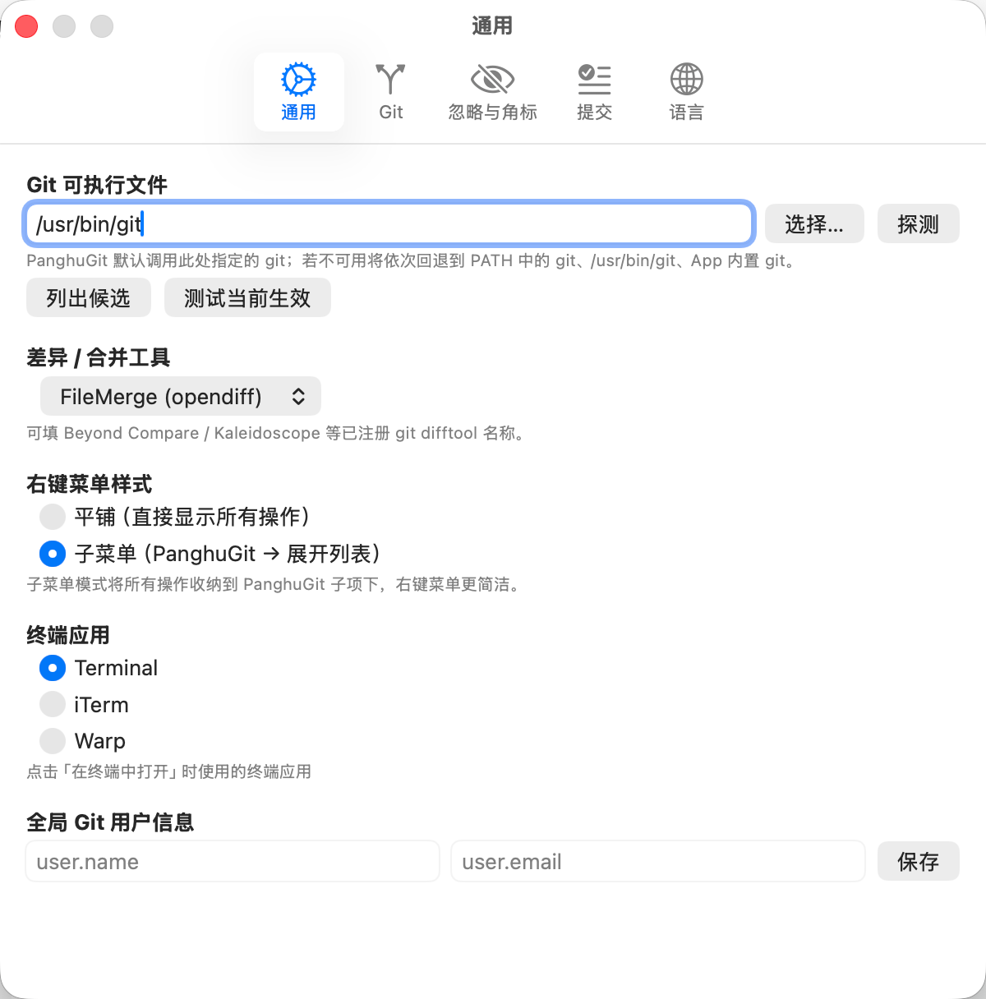

### General 标签页

| 设置 | 默认值 | 说明 |
|------|--------|------|
| Git Executable | `/usr/bin/git` | Git 可执行文件路径 |
| Diff/Merge Tool | Built-in | 外部 diff 工具：Built-in / FileMerge (opendiff) / Vimdiff / Custom |
| Context Menu Style | Submenu | 右键菜单样式：Flat / Submenu |
| Terminal App | Terminal | 终端应用：Terminal / iTerm / Warp |
| Global User Info | — | 全局 `user.name` / `user.email` |

#### Git 路径探测

- **Probe**：测试指定路径的 git 版本
- **List Candidates**：列出所有候选 git 路径
- **Test Effective**：显示实际使用的 git 路径

#### Git 路径优先级

1. 用户指定的路径
2. PATH 中的 git（`which git`）
3. 系统 git（`/usr/bin/git`）
4. 内嵌 git（`Resources/git/bin/git`）

### Git 标签页


| 设置 | 默认值 | 说明 |
|------|--------|------|
| Default Branch | `main` | `git init` 的默认分支名 |

### Ignore & Badges 标签页

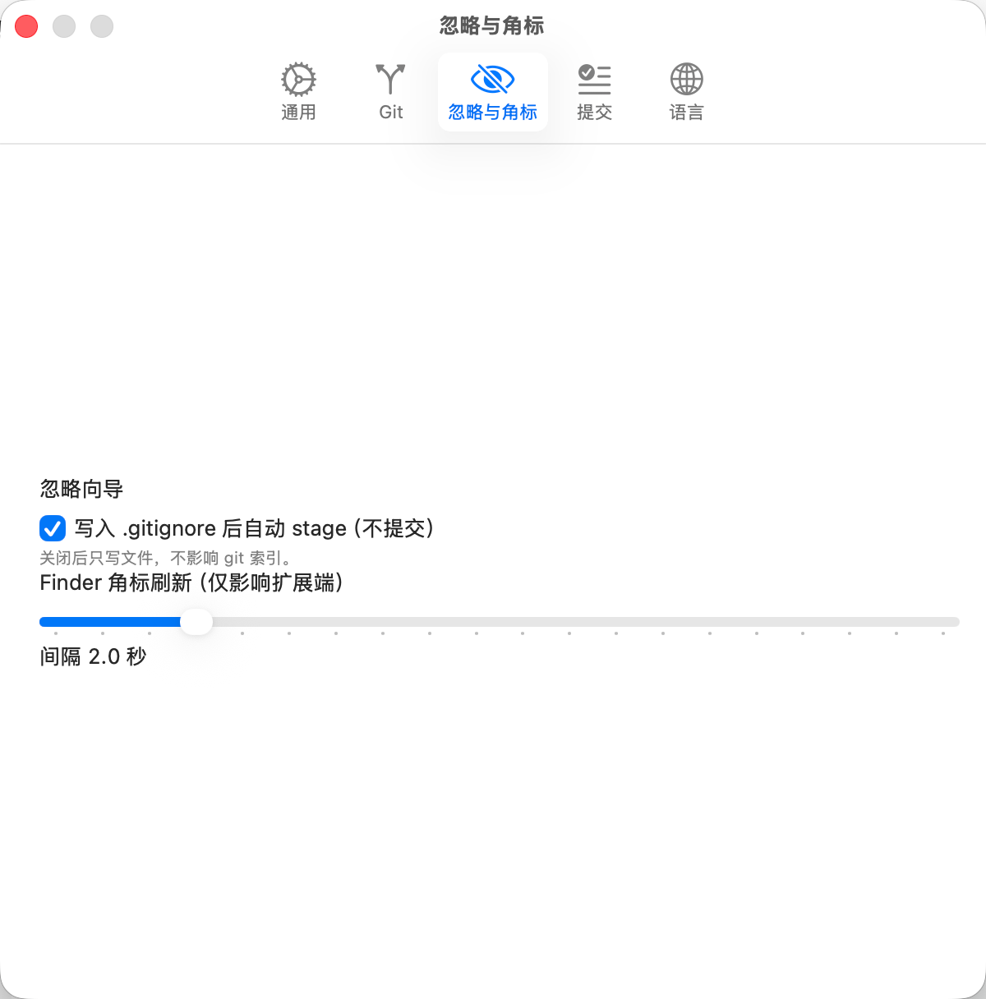

| 设置 | 默认值 | 说明 |
|------|--------|------|
| Auto stage .gitignore | ✅ | 写入 .gitignore 后自动 `git add` |
| Badge refresh interval | 2.0 秒 | Finder 角标刷新间隔（0.5–10 秒） |

### Commit 标签页


| 设置 | 默认值 | 说明 |
|------|--------|------|
| Enable Conventional Commits | ✅ | 显示提交类型快捷按钮 |
| Custom Templates | 空 | 自定义提交模板列表 |

### Language 标签页


| 设置 | 默认值 | 说明 |
|------|--------|------|
| Interface Language | Follow System | 界面语言：跟随系统 / 简体中文 / English |

---

## 28. 帮助菜单

菜单栏包含以下帮助菜单项：

| 菜单项 | 操作 |
|--------|------|
| Keyboard Shortcuts | 打开快捷键参考表 |
| Documentation | 打开 GitHub Wiki |
| Report Issue | 打开 GitHub Issues |
| About PanghuGit | 显示关于面板 |

---

## 29. 命令行接口

PanghuGit 支持命令行调用（例如通过 `/usr/local/bin/panghugit` 符号链接）。

### 只读命令（输出到 stdout，适合脚本使用）

| 命令 | 说明 |
|------|------|
| `version` / `--version` / `-v` | 输出版本号 |
| `which <path>` | 输出路径对应的仓库根目录 |
| `branch <path>` | 列出分支（`*` 标记当前分支） |
| `tag <path>` | 列出标签 |
| `status-lines <path>` | 输出 porcelain 格式状态行 |
| `log <path> [--author <n>] [--branch <r>] [--since <d>] [-n <c>] [--oneline] [--graph]` | 输出提交历史 |
| `diff <path> [--staged\|--cached\|--HEAD\|<a> <b>] [-- <file>]` | 输出 patch |
| `show <path> <ref> [--stat\|--patch]` | 输出提交信息 + patch |

### GUI 命令（打开应用窗口）

| 命令 | 说明 |
|------|------|
| `open <action> <path>` | 打开指定窗口 |
| `<action> <path>` | 等同于 `open <action> <path>` |

---

## 30. 快捷键一览


| 视图 | 快捷键 | 操作 |
|------|--------|------|
| Commit | ⌘↩ | 提交 |
| Commit | ⌘⇧↩ | 提交并推送 |
| Commit | ⌘⇧S | 暂存选中文件 |
| Commit | ⌘⌥S | 取消暂存选中文件 |
| Commit | ⌘⇧A | 切换 Amend |
| Commit | ⌘/ | 切换 Skip Hooks |
| Log | ⌘C | 复制 SHA |
| Log | ⌘⌥C | 复制提交信息 |
| Sync | ⌘P | Pull |
| 全局 | ⌘R | 刷新 |

---

## 31. 常见问题

### Q: 右键菜单中没有 PanghuGit？

1. 确认已安装到 `/Applications/`
2. 前往 **系统设置 → 隐私与安全性 → 扩展** 中启用 PanghuGit Finder Sync
3. 尝试重启 Finder：终端执行 `killall Finder`

### Q: 角标不显示？

1. 确认 Finder Sync 扩展已启用
2. 调大 Badge refresh interval（Settings → Ignore & Badges）
3. 执行一次 Git 操作触发刷新

### Q: 提交后角标没更新？

角标会在下一次定时刷新时更新，也可手动触发：Settings 中调整刷新间隔。

### Q: Push 被拒绝？

远端有更新的提交，需要先 Pull 再 Push。如果使用了 Amend，需要 Force Push（推荐 Force with Lease）。

### Q: Merge 冲突怎么办？

PanghuGit 自动检测冲突并打开冲突解决面板，使用三方合并视图逐块选择 Ours/Base/Theirs，解决后 Continue 完成合并。

### Q: 如何切换界面语言？

**Git Settings → Language** 中选择 简体中文 / English / Follow System，切换后需要重启应用。

### Q: 如何配置自定义 Git 路径？

**Git Settings → General → Git Executable** 中输入路径，点击 Probe 验证版本。

### Q: 从 DMG 直接双击运行有问题吗？

PanghuGit 启动时会自动检测 App Translocation，并提示将应用拖入 `/Applications/`。请始终从 `/Applications/` 启动。

---

*PanghuGit v1.0.0 — macOS Finder right-click Git tool*
